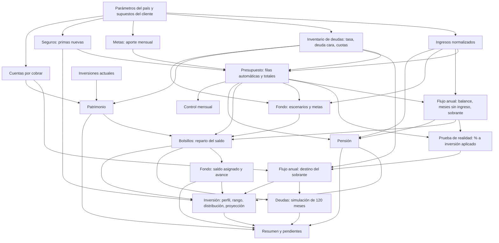

# 01. Análisis del dominio

Fuentes: protocolo versión 2.2 [I1], plantilla principal [I2], plantilla de créditos [I3] y los dos casos reales en `referencia/casos/` [I4]. Las fórmulas se extrajeron con `tools/excel-extractor/`, leyendo cada libro dos veces (fórmulas y valores en caché). El inventario completo, celda por celda, está en [anexos/inventario-formulas/](anexos/inventario-formulas/).

## 1. Resumen del protocolo

### 1.1 Principios (sección 2 del protocolo)

1. Primero estabilidad (flujo positivo, deudas caras controladas, fondo de emergencia), después protección (seguros, pensión, sucesión) y al final crecimiento (inversión).
2. Ahorrar primero y gastar lo que queda, con transferencias automáticas el día del ingreso.
3. Cada peso tiene un destino: cuenta operativa, bolsillo, ahorro o inversión.
4. El plan respeta el estilo de vida: se muestran costos y alternativas, no se imponen recortes.
5. Riesgos grandes y poco probables a seguros; pequeños y frecuentes al fondo de emergencia.
6. Revisión con datos reales a los 30 y 90 días.
7. La inversión se ajusta a plazo, edad y perfil de riesgo; manda el más prudente de los tres.

### 1.2 Fases y su equivalente en la plataforma

| Fase | Objetivo | Resultado en el protocolo | Equivalente en la plataforma |
|---|---|---|---|
| 1. Cuestionario inicial | Perfil, ingresos, gastos, deudas (parte 1); patrimonio, protección, metas (parte 2) | Información base | Captura guiada por bloques A a G; el asesor la llena durante o después de la entrevista |
| 2. Tipo de cliente | Aplicar reglas del perfil | Enfoque | Campo tipo de cliente con sus reglas (meses de fondo, ingreso base, capacidad) |
| 3. Procesamiento | Normalizar y clasificar | Presupuesto y patrimonio | Motor: normalización por frecuencia, clasificación por tipo, esencial |
| 4. Aclaraciones | Resolver ambigüedades | Datos confirmados | Marca "por confirmar" por campo (hoy celdas ámbar) y lista de pendientes |
| 5. Prueba de realidad | Ahorro real frente al calculado | Presupuesto validado | Módulo prueba de realidad; cambia el % a inversión |
| 6. Diagnóstico | Indicadores, fortalezas, alertas | Diagnóstico | Resumen con semáforo |
| 7. Análisis | Meses sin ingreso, fondo, deudas, bolsillos, seguros, pensión, inversión, metas, cobros, impuestos, sucesión | Plan concreto | Módulos de cálculo y listas de remisión a profesionales |
| 8. Excel | Llenar la plantilla | Archivos .xlsx | Datos vivos en la plataforma; exportación compatible |
| 9. Control de calidad | Verificar antes de entregar | Entregables revisados | Validaciones automáticas antes de poder entregar un plan |
| 10. Carta de cierre | Resumen, diagnóstico, plan, calendario, alcance | Carta al cliente | Editor de carta con cifras enlazadas; PDF |
| 11. Ajustes | Correcciones | Versión final | Historial de cambios y tabla de antes y después |
| 12. Seguimiento | 30 días, 90 días, anual, eventos de vida | Plan vivo y ficha de continuidad | Recordatorios, planes entregados versionados, ficha generada |

### 1.3 Límites éticos que el producto debe respetar (sección 0.3)

- No recomendar productos ni entidades; mostrar capacidad, criterios, plazos y rangos.
- No prometer rendimientos; toda proyección es ilustrativa.
- Impuestos al contador, pensión a la administradora, sucesión a abogado o notaría.
- Sin conflictos de interés.
- No pedir ni guardar números de documento, cuenta, tarjeta ni claves.
- Autorización de tratamiento de datos antes de empezar.
- Todas las cifras futuras en moneda de hoy (sin inflación), dicho explícitamente.
- Una cifra se calcula una sola vez y se reutiliza igual en todas partes (plan, carta, notas).

## 2. Libros analizados

| Libro | Hojas | Fórmulas | Observaciones |
|---|---|---|---|
| Plantilla principal [I2] | 17 | 5.739 | Marca Petróleo y Oro. 4.391 fórmulas son la simulación de deudas a 120 meses. Sin nombres definidos. Fecha de corte `=TODAY()` por defecto. |
| Plantilla de créditos [I3] | 13 | 57.447 | 8 hojas de crédito idénticas de 360 cuotas y un motor de plan de pago de 360 meses. |
| Caso España [I4] | 19 | Plantilla principal más las hojas "Notas" y "Costo de vida" | Adaptada a euros. Fecha de corte fija. Tiene valores en caché en todos los indicadores de la prueba de oro. |
| Caso Colombia [I4] | 12 | 614 | **No es la plantilla oficial**: es un libro anterior con estructura propia (hojas como Flujo 2027, Enero y Viaje Chicago). Es el caso de referencia de la sección 15 del protocolo, pero sus resultados difieren de los publicados allí (ver hallazgo H-25). |

## 3. Inventario de la plantilla principal

Convenciones de la plantilla: celdas crema (#FFF8E6) editables; ámbar (#FDE9B8) por confirmar; negro, fórmulas; filas grises, automáticas. Pestañas doradas con datos, verde azulado solo cálculo, petróleo portada y resumen.

### 3.1 Tabla de hojas

| Hoja | Tipo | Entradas (celdas crema) | Salidas principales | Depende de |
|---|---|---|---|---|
| Inicio | Portada | Ninguna relevante | Nombre del cliente, fecha de corte | Supuestos |
| Resumen | Resultado | Ninguna | 25 indicadores con estado, 10 pendientes, tabla de sensibilidad a la tasa de cambio | Todas las de cálculo |
| Supuestos | Entrada | Marca, nombre, nacimiento, sexo, tipo de cliente, personas a cargo, fecha de corte, año del flujo, tasa de cambio, salario mínimo, meses de fondo (opcional), umbral de deuda cara, % a inversión (confirmada y pendiente), % a deudas, % del excedente a inversión, rendimientos reales, edad de retiro, reducción anual y piso del % en crecimiento, colchón operativo; prueba de realidad (C35:C37); cuentas por cobrar (B46:E48, H46:H48) | Edad, meses de fondo efectivos, estado de la prueba de realidad, % a inversión aplicado, saldo por cobrar | Flujo anual, Presupuesto, Listas |
| Ingresos | Entrada | 8 fuentes: nombre, tipo, moneda, valor mensual, 1 o 0 por mes (G:R), nota; meses con pago de seguridad social (G17:R17); 12 meses de historia para ingreso variable (G29:R29) | Valor en moneda base, meses, total anual, promedio; totales por mes y por tipo; ingreso anual en USD; ingreso base sugerido | Supuestos |
| Presupuesto | Entrada | 75 filas (13 a 87): categoría, concepto, valor por pago, frecuencia, días que dura, tipo, bolsillo, esencial, nota. 43 conceptos típicos precargados. Filas 6 a 12 automáticas (deudas, seguros nuevos, 5 metas) | Veces al año, total anual, promedio mensual; totales por tipo (filas 89 a 96); fila de control 97 | Deudas, Ingresos, Metas, Seguros, Listas |
| Deudas | Entrada y cálculo | Método (C6); 8 deudas: nombre, tipo, saldo, tasa EA, cuota mínima, ¿acepta abonos?, abonos desde | Tasa mensual, deuda cara, orden, meses para pagar, fecha de salida, intereses con plan y solo con cuota; totales; carga de deuda; simulación de 120 meses | Supuestos, Ingresos, Flujo anual, Bolsillos |
| Flujo anual | Cálculo | Ninguna | Entradas y salidas por mes; balance; meses sin ingreso (faltante, aporte igual o proporcional, cobertura); sobrante; destino (deudas, inversión, margen); cuentas por cobrar por mes; alerta de déficit | Ingresos, Presupuesto, Deudas, Supuestos |
| Bolsillos | Entrada y cálculo | Qué guarda, cuándo se usa y saldo inicial de 10 bolsillos (filas 8 a 17) | Meta anual y aporte mensual por bolsillo; saldo inicial sugerido de fondo y meses sin ingreso; reparto del saldo actual; abono único a deuda o aporte único a inversión; alerta de sobreasignación | Fondo emergencia, Flujo anual, Presupuesto, Patrimonio, Deudas, Supuestos, Listas |
| Fondo emergencia | Cálculo | Ninguna | Escenarios A, B y C; meta por peor caso; mínimo de 1 mes; meta vigente (1 mes con deuda cara); comparación con 6 meses de gasto total; avance | Presupuesto, Ingresos, Supuestos, Deudas, Bolsillos |
| Metas | Entrada | 5 metas: nombre, bolsillo, valor, ¿usa calculadora de viaje?, ya ahorrado, se repite cada (años), fecha objetivo; calculadora de viaje en USD | Valor usado, meses restantes, aporte mensual (pasa al Presupuesto) | Supuestos |
| Seguros | Entrada | 8 seguros típicos y 2 libres: ¿lo tiene?, beneficiarios, prima anual cotizada | Costo mensual de seguros nuevos (pasa al Presupuesto); suma asegurada orientativa de vida | Deudas, Presupuesto, Patrimonio, Supuestos |
| Inversión | Entrada y cálculo | 6 inversiones actuales; respuestas 27a, 27b, 27c; condiciones de capacidad (editables); posición en el rango | Disposición, capacidad, perfil final; rango por edad; % en crecimiento; distribución mensual, anual y del aporte único; movimiento sugerido; proyección ilustrativa de 10 años | Bolsillos, Deudas, Flujo anual, Fondo emergencia, Pensión, Seguros, Supuestos, Listas |
| Pensión | Entrada y cálculo | Régimen, semanas, fecha de las semanas, base de cotización en salarios mínimos, hijos, ¿descuento por hijos?, % de salud, % de salud y ARL si sigue trabajando | Edad y fecha de pensión, semanas proyectadas, semanas requeridas, meses faltantes, tabla año por año, mesada en 3 escenarios de IBL, flujo después de pensionarse (dos escenarios), brecha pensional | Supuestos, Ingresos, Presupuesto, Flujo anual |
| Patrimonio | Entrada | 20 activos: nombre, tipo, moneda, valor, ¿genera ingreso? | Totales, patrimonio neto, composición por tipo, concentración en inmuebles y vehículos | Inversión, Supuestos, Deudas |
| Control mensual | Entrada | Gasto real por categoría y mes (D6:O23) | Presupuesto mensual por categoría, promedio real, diferencia, % de desviación (alerta visual sobre 10 %) | Presupuesto, Listas |
| Plan de acción | Entrada | 22 tareas: tarea, prioridad, responsable, fecha, estado, nota; 14 tareas precargadas | Fechas relativas a la fecha de corte; tareas vencidas resaltadas | Supuestos |
| Listas | Catálogo | Nombres de bolsillos (F2:F11) | Catálogos de validación (25 listas) | Ninguna |

### 3.2 Fórmulas clave por hoja

**Normalización (Presupuesto columna G).** Veces al año según la frecuencia: semanal 52, quincenal 24, mensual 12, bimestral 6, trimestral 4, cada 4 meses 3, semestral 2, anual 1, cada 2 años 0,5; "Por duración (días)" = 365 / días; "Meses con seguridad social" = número de meses marcados en `Ingresos!S17`. Total anual `H = D x G`; promedio `I = H / 12`.

**Ingresos.** `F = E x tasa` si la moneda es USD, si no `F = E`. `S = suma de los 12 meses`, `T = F x S`, `U = T / 12`. Total por mes `SUMPRODUCT(F, mes)`. Ingreso base variable = `MIN(promedio de 12 meses, promedio de los 3 más bajos)`.

**Presupuesto, totales.** Gasto total = todo lo que no es "Ahorro"; subtotales por tipo (Directo, Bolsillo, Seg. social, Deuda, Ahorro); gasto esencial = esencial "Sí" y tipo distinto de Ahorro; seguridad social por mes de pago = suma de los valores por pago del tipo Seg. social.

**Flujo anual.** Entradas por mes = ingresos por tipo según los meses marcados. Salidas por mes = seguridad social (solo en meses marcados) + promedios mensuales de pagos directos, bolsillos, deudas y ahorro. Balance = entradas - salidas. Meses sin ingreso:

- Faltante total = suma de balances negativos (en valor absoluto).
- Si el menor balance positivo alcanza para un aporte igual (faltante / meses positivos), se aporta igual en cada mes positivo; si no, se aporta en proporción al balance de cada mes positivo.
- Cobertura = mín(1, suma de positivos / faltante). Uso del bolsillo en mes rojo = |balance| x cobertura.
- Sobrante del mes = balance + uso - aporte.
- Destino: con deuda cara, 90 % del sobrante positivo a deudas; sin deuda cara, % a inversión según la prueba de realidad (70 % o 50 %); el resto es margen libre.
- Cuentas por cobrar: abonos por mes según fecha del primer pago y número de cuotas; con deuda cara van a deudas, si no, el % a inversión de cada deudor.

**Bolsillos.** Fondo: meta = meta vigente; saldo inicial sugerido = mín(meta, disponible); aporte para completarlo en 12 meses = (meta - saldo) / 12. Meses sin ingreso: meta = faltante total; aporte = aporte igual del flujo; saldo = mín(faltante, disponible - fondo). Otros 10 bolsillos: meta y aporte = suma del Presupuesto con ese nombre de bolsillo. Disponible = activos líquidos - colchón. Excedente = disponible - saldos asignados. Con deuda cara, 90 % del excedente es abono único a deudas; si no, 50 % es aporte único a inversión.

**Fondo de emergencia.** Escenario A (pierde laboral): conserva rentas + pensión + otros. B (pierde rentas): conserva laboral + pensión + otros. C (peor caso): conserva solo pensión. Faltante = máx(0, gasto esencial - ingreso que se mantiene). Meta completa = máx(meses x faltante C, 1 mes de gasto esencial). Meta vigente = mín(meta completa, 1 mes de esencial) si hay deuda cara. Avance = saldo asignado / meta completa.

**Deudas.** Tasa mensual = (1 + EA)^(1/12) - 1. Deuda cara si EA ≥ umbral (20 % por defecto). Orden: avalancha por tasa descendente o bola de nieve por saldo ascendente, desempate por fila. Simulación de 120 meses con pago total constante = cuotas mínimas + extra mensual (`Flujo anual!Q34 / 12`): cada mes el saldo crece con el interés, se paga el mínimo, y el disponible para extra (pago total - mínimos aplicados) va en orden a las deudas que aceptan abonos desde su fecha; lo que no se puede abonar pasa a la siguiente. Abono único inicial en orden a las deudas que aceptan abonos desde el primer mes. Meses para pagar = meses con saldo > 0,5 + 1, o "Más de 120". Intereses con el plan = pagos + saldo final - saldo inicial. Intereses solo con la cuota = `cuota x NPER(i, -cuota, saldo) - saldo`.

**Metas.** Si se repite: aporte = valor / (años x 12). Si tiene fecha: meses = máx(1, meses completos desde la fecha de corte); aporte = máx(0, (valor - ya ahorrado) / meses). Calculadora de viaje: partidas en USD x cantidad + impuesto del alojamiento + colchón de 5 %, convertido con la tasa, más trayectos nacionales.

**Seguros.** Costo de seguros nuevos = primas cotizadas de los que no se tienen. Suma asegurada de vida = máx(0, deudas + gasto anual x años de apoyo - patrimonio líquido e inversiones); años de apoyo = 10 si hay personas a cargo.

**Inversión.** Disposición por puntos (2 a 3 conservador, 4 a 5 moderado, 6 tolerante). Capacidad: 5 condiciones; 0 condiciones tolerante, 1 moderado, 2 o 3 conservador, 4 o más "no invertir todavía"; con deuda cara, 0. Perfil final = mín(disposición, capacidad). Rango por tramo de edad (0, 35, 50, 60) y perfil. % en crecimiento = mínimo + posición x (máximo - mínimo); 0 si el plazo es menor a 3 años o el perfil es 0. Proyección de 10 años: el % baja 2 puntos por año en los 10 años previos al retiro con piso de 10 %; rendimiento mezclado = % x 5 % + (1 - %) x 1,5 %; rendimiento del año = (saldo inicial + aportes / 2) x tasa.

**Pensión (Colombia).** Edad 57 mujeres, 62 hombres. Semanas proyectadas = semanas + meses hasta la edad x (meses cotizados / 12) x 30/7. Semanas requeridas: hombres 1.300 (Colpensiones) o 1.150 (fondo privado); mujeres en Colpensiones `máx(1.000, 1.250 - 25 x (año - 2026))`, en fondo privado `máx(1.000, 1.135 - 15 x (año - 2026))`; menos 50 por hijo (máximo 3) si se aplica. IBL en 3 escenarios (base - 1, base - 0,5 y base, en salarios mínimos). Tasa de reemplazo = (65,5 - 0,5 x IBL) %, entre 55 % y 65 %. Mesada = máx(salario mínimo, IBL x tasa); neta = bruta x (1 - 12 %). Brecha si el sobrante del escenario medio al dejar de trabajar es negativo (fondos privados: "Revisar con el fondo").

**Patrimonio.** Activos por tipo (Líquido, Inversión, Inmueble, Vehículo, Por cobrar, Otro); inversiones y cuentas por cobrar entran automáticamente; neto = activos - deudas; concentración = (inmuebles + vehículos) / activos.

**Resumen.** Semáforo: sobrante < 0 alerta; tasa de ahorro ≥ 20 % bien, ≥ 10 % atención, si no alerta; carga de deuda < 30 % bien, < 40 % atención; liquidez ≥ 3 meses bien, ≥ 1 atención; avance del fondo ≥ 99,9 % bien, ≥ 50 % atención; concentración ≤ 80 % bien; prueba de realidad confirmada bien, pendiente atención, revisar gastos alerta. Sensibilidad a la tasa de cambio con factores 0,85 a 1,10.

### 3.3 Orden de dependencias entre hojas

A nivel de hoja hay ciclos (Deudas usa el Flujo anual y el Flujo anual usa Deudas), pero a nivel de celda el grafo es acíclico. Este es el orden de cálculo celda a celda que el motor debe respetar:

### 3.4 Plantilla de créditos

| Hoja | Qué hace |
|---|---|
| Datos | Cliente, fecha de corte (`=TODAY()`), tasa de cambio, 5 ingresos (moneda, valor, meses al año), gastos de vida opcionales. Carga financiera con 4 niveles (sana hasta 30 %, alta hasta 40 %, muy alta hasta 50 %, crítica). Sensibilidad a la tasa de cambio. |
| Crédito 1 a 8 | Datos del crédito (saldo al inicio de la tabla, fecha y número de la primera cuota, plazo, tasa EA, cuota con seguros, seguros incluidos, monto original, ¿acepta abonos?, abonos desde la cuota N, puntos FRECH y hasta qué cuota). Tabla de 360 cuotas: interés, seguros, subsidio FRECH, cuota del mes o cuota distinta, abono extra, abono a capital, saldo, lo que paga el cliente, pagado sí o no, fecha real, estado (pagada, vencida, próxima, pendiente). Estado actual: saldo, próxima cuota, cuotas vencidas sin marcar, fecha fin, intereses pendientes. Simuladores: "si pagara este extra fijo" y "para terminar en N meses". |
| Plan de pago | Método avalancha, bola de nieve u **orden manual**; dinero extra adicional; motor mes a mes de 360 meses para los 8 créditos (con seguros); comparación con y sin plan: fecha de fin, meses antes, intereses y seguros. |
| Panel | Deuda total, pago del próximo mes, intereses por pagar, capital pagado, fecha de libertad de deudas, cuotas vencidas; calendario ordenado por fecha; pagos por tramo del mes (1 a 10, 11 a 20, 21 a 31); abono extra sugerido; hitos (cuota que se libera y carga después); deuda año por año; sección 7 con los datos para pegar en la hoja Deudas de la plantilla principal. |

El subsidio FRECH se calcula como `saldo x (tasa mensual - tasa mensual sin los puntos cubiertos)` hasta la cuota indicada, y "lo que pagas" = pago total - subsidio.

### 3.5 Adaptaciones del caso de España

La comparación celda a celda con la plantilla muestra cómo se resolvió el caso sin cambiar la estructura. Son necesidades de esa clienta, no de España: cualquier cliente puede tenerlas o no, sea del país que sea.

| Necesidad | Solución en el Excel | Consecuencia |
|---|---|---|
| Moneda base euro | `Listas!M2 = "EUR"` y la "tasa de cambio" pasó a ser EUR por USD (`=1/1,149`) | La semántica de la tasa cambia sin que la plantilla lo sepa |
| Los padres pagan todo el estilo de vida | Ingreso tipo "Otro" `= Presupuesto!I89` (igual al gasto total) | Ingreso anual 15.710 EUR y tasa de ahorro 30,6 %, cuando sobre su propio sueldo ahorra el 100 % (el Excel lo aclara en Notas) |
| Sueldo 100 % a ahorro | Implícito: el sobrante es exactamente el sueldo | La secuencia "primero el fondo, luego invertir" se explica en texto; el Flujo anual invierte el 50 % desde el primer mes |
| Escenarios de costo de vida | Hoja nueva "Costo de vida": esencial (solo filas esenciales), básico (valores propuestos por el asesor en celdas crema), actual; costo sin matrícula; comparación con el umbral fiscal de 8.000 EUR | Los valores del nivel básico viven fuera del Presupuesto |
| Gastos familiares fuera del presupuesto | Texto en la hoja Costo de vida y en Notas | No hay registro estructurado |
| Notas para el cliente | Hoja "Notas" en segunda persona con 15 cifras enlazadas a celdas | Si cambia un dato, las cifras cambian pero el texto no |
| Edad de jubilación de España | `Supuestos!C29 = 67` (se reemplazó la fórmula) | La hoja Pensión se marca "no aplica" |
| Ingreso poco estable | `Inversión!C25 = "Sí"` (se reemplazó la fórmula) | La condición de capacidad no depende solo del tipo de cliente |
| Plan de acción | Fechas relativas reordenadas; 4 tareas sin fecha | Las tareas precargadas no aplican igual a todos los casos |

## 4. Reglas de negocio

Numeradas para citarlas desde el código, las pruebas y los ADR. "P" indica sección del protocolo; "X", celda de la plantilla.

### 4.1 Cliente, país y parámetros

- **RN-001** Cada cliente tiene país, moneda base, fecha de corte y tratamiento (tú o usted). La fecha de corte es explícita; por defecto, la fecha de creación de la versión de trabajo (X `Supuestos!C12`).
- **RN-002** Edad = años completos entre nacimiento y fecha de corte (X `Supuestos!C13`, `DATEDIF`).
- **RN-003** Año del flujo = año de la fecha de corte + 1, editable (X `Supuestos!C14`).
- **RN-004** Meses de fondo sugeridos por tipo de cliente: empleado 3, contratista 4, independiente variable 6, pensionado 3, rentista 4, mixto 4; el asesor puede fijar otro valor (P4, X `Supuestos!C19:C21`).
- **RN-005** Los parámetros por país (salario mínimo, tasa de cambio de referencia, edad de retiro, umbrales fiscales, reglas de pensión) están versionados con vigencia, fuente y fecha; un cálculo usa la versión vigente a su fecha de corte.
- **RN-006** Todas las cifras futuras están en moneda de hoy y la interfaz lo dice (P0.2).

### 4.2 Ingresos

- **RN-010** Todo importe tiene moneda propia (ingresos, gastos, bolsillos, deudas, metas, primas, activos, inversiones, cobros, control mensual). Se convierte a la moneda base con la tasa que realmente recibe el cliente (P4, X `Ingresos!F`). Decisión del 28/09/2026: la plataforma es multimoneda en general, con selector de moneda en cada campo de dinero.
- **RN-011** Cada ingreso indica cuántos pagos llegan en cada mes (0, 1 o más); total anual = valor x pagos del año (X `Ingresos!S:T`).
- **RN-012** Tipos de ingreso: laboral, renta, pensión, otro; y en la plataforma, además, aporte de terceros (ver RN-015).
- **RN-013** Ingreso base para ingresos variables = mín(promedio de 12 meses, promedio de los 3 meses más bajos); lo que llegue por encima se reparte con una regla fija (P4, X `Ingresos!E32`).
- **RN-014** Un ingreso puede marcarse "100 % a ahorro": no financia gastos y alimenta el plan de ahorro (fondo primero, luego inversión y ahorro líquido).
- **RN-015** Los gastos pagados por un tercero generan un **aporte implícito del tercero** del mismo valor, que en el flujo y en los escenarios del fondo se trata como ingreso tipo "otro". Los indicadores personales (ingreso propio, tasa de ahorro sobre ingreso propio) lo excluyen. Así el cálculo coincide con el Excel del caso de España y los indicadores dejan de distorsionarse (ver H-12).
- **RN-016** Abonos de deudas que le pagan al cliente no son ingreso; van a cuentas por cobrar (P0.2, P5.3).
- **RN-017** Cada moneda distinta de la base necesita una tasa del cliente con fecha. Sin tasa no se puede guardar el importe (base de datos) ni entregar un plan (control de calidad). Todas las conversiones usan la tasa vigente del cliente (moneda de hoy); el riesgo cambiario se muestra con la sensibilidad (RN-132).
- **RN-018** El país del cliente define moneda base, formato y parámetros. Cualquier país se puede habilitar; los módulos con reglas propias de un país (pensión, umbrales fiscales) solo aparecen donde existen. El país no decide nada más del caso: quién paga cada gasto, si se analiza la pensión, el tipo de cliente o los niveles de costo de vida se marcan cliente por cliente.

### 4.3 Presupuesto

- **RN-020** Total anual = valor por pago x veces al año según la frecuencia; promedio mensual = total / 12 (P5.1).
- **RN-021** "Por duración" = 365 / días que dura; "meses con seguridad social" = número de meses con pago marcado.
- **RN-022** Cada gasto tiene tipo: directo, bolsillo, seguridad social, deuda o ahorro. Ahorro no es gasto (P5.2).
- **RN-023** Cada gasto se marca esencial sí o no; gasto esencial = esencial y no ahorro (X `Presupuesto!H95`).
- **RN-024** Cada gasto indica quién lo paga: el cliente, la familia o los padres, u otro tercero.
- **RN-025** Un gasto puede ser **referencia familiar**: se registra como nota (vivienda de la familia, comida en casa, carro familiar) y no suma en ningún cálculo.
- **RN-026** Un gasto puede marcarse **temporal** (por ejemplo, la matrícula) para calcular el costo sin él.
- **RN-027** Si el ingreso llega neto y la seguridad social se paga aparte, la seguridad social es gasto, solo en los meses en que se paga (P5.3).
- **RN-028** Las filas automáticas (cuotas de deudas, seguros nuevos, aportes a metas) no se editan en el presupuesto; se editan en su módulo.
- **RN-029** Control: ninguna fila puede tener valor sin frecuencia o sin tipo (X `Presupuesto!I97`); tampoco un gasto tipo bolsillo sin bolsillo asignado (nuevo, ver H-02).

### 4.4 Escenarios de costo de vida

- **RN-030** Tres niveles por gasto: esencial (el valor actual si es esencial, si no 0), básico (propuesto por el asesor, editable solo por él) y actual.
- **RN-031** Para cada nivel: costo al mes, cuánto paga cada pagador, costo sin los gastos temporales y comparación con los umbrales fiscales del país que apliquen al cliente.
- **RN-032** El total del nivel actual debe coincidir con el gasto total del presupuesto (control de la hoja Costo de vida, fila 39).

### 4.5 Flujo anual y meses sin ingreso

- **RN-040** Salidas mensuales = seguridad social del mes + promedios mensuales de directos, bolsillos, deudas y ahorro (X `Flujo anual!13:17`).
- **RN-041** Faltante de meses en rojo, aporte igual o proporcional y cobertura según la sección 3.2 (P8.1).
- **RN-042** Si los meses positivos no cubren el faltante, alerta de déficit y sobrante anual negativo (P8.1).
- **RN-043** Destino del sobrante: con deuda cara, 90 % a deudas; si no, el % a inversión según la prueba de realidad; el resto margen libre (X `Flujo anual!24:26`).
- **RN-044** Abonos por cobrar por mes; con deuda cara van a deudas, si no, el % a inversión de cada deudor (X `Flujo anual!28:31`).

### 4.6 Prueba de realidad

- **RN-050** Ahorro real mensual = (ahorro hoy - ahorro hace N meses) / N, sin ingresos extraordinarios (P6.2).
- **RN-051** Ahorro esperado = (sobrante anual + ahorro programado) / 12.
- **RN-052** Estado: "Confirmada" si la diferencia relativa es ≥ -15 %; "Revisar gastos" si es menor; "Pendiente" si faltan datos.
- **RN-053** % del sobrante a inversión: 70 % si está confirmada, 50 % en los demás casos (parámetros editables).
- **RN-054** Si la prueba muestra gastos no registrados, se sugiere crear la partida "gastos no identificados" con la diferencia (P6.2; hoy es manual).

### 4.7 Cuentas por cobrar

- **RN-060** Número de cuotas = redondeo hacia arriba de saldo / cuota; último pago = primer pago + (cuotas - 1) meses.
- **RN-061** Saldo pendiente hoy = saldo - cuota x cuotas ya vencidas a la fecha de corte.
- **RN-062** Fuera del presupuesto; destino por defecto inversión (100 %), o deudas si hay deuda cara (P5.3, P8.11).

### 4.8 Bolsillos y bancos

- **RN-070** Un banco tiene nombre, país, límite de bolsillos o subcuentas y si es remunerado. No se guarda número de cuenta.
- **RN-071** Un bolsillo pertenece a una cuenta de un banco. Aporte mensual = suma de promedios de sus partidas del presupuesto (P8.4).
- **RN-072** Alerta si los bolsillos con aporte superan el límite del banco (X `Bolsillos!C29`).
- **RN-073** Reparto del saldo actual en orden: fondo completo (o 1 mes de esencial con deuda cara), meses sin ingreso, saldos iniciales de otros bolsillos; el excedente se divide (P8.4, X `Bolsillos!21:28`).
- **RN-074** Alerta si los saldos iniciales superan lo disponible (X `Bolsillos!B30`).

### 4.9 Fondo de emergencia

- **RN-080** Escenarios A, B y C y metas según la sección 3.2 (P8.2).
- **RN-081** Mínimo de un mes de gasto esencial aunque la pensión o las rentas cubran todo.
- **RN-082** Con deuda cara, meta vigente de 1 mes de lo esencial; luego se paga la deuda y se completa (P8.2).
- **RN-083** El fondo nunca se invierte en activos volátiles (P8.2).
- **RN-084** Comparación con la regla de 6 meses de gasto total y capital que se libera.

### 4.10 Deudas y créditos

- **RN-090** Deuda cara si la tasa EA ≥ umbral (20 % por defecto, editable); con cuotas sobre 40 % del ingreso, el asesor puede bajar el umbral y debe anotarlo como supuesto (P8.3.9).
- **RN-091** Métodos: avalancha (por defecto), bola de nieve u orden manual.
- **RN-092** Restricciones de abono: "¿acepta abonos extra?" y "desde" (fecha o número de cuota); lo que no se abona pasa a la siguiente deuda (P8.3.7).
- **RN-093** Pago total constante: cuando una deuda termina, su cuota pasa a la siguiente (P8.3.8).
- **RN-094** Horizonte: 120 meses en el diagnóstico (plantilla principal) y 360 en el seguimiento de créditos; la plataforma usa un solo motor con horizonte como parámetro (ver H-06).
- **RN-095** FRECH: puntos de tasa cubiertos hasta una cuota; el cliente paga la cuota menos el subsidio.
- **RN-096** Seguros incluidos en la cuota se separan del capital y del interés.
- **RN-097** Con deuda cara no se invierte (P8.3.4).
- **RN-098** En créditos largos, los abonos se piden como reducción de plazo, no de cuota (P8.3.6; texto de ayuda).
- **RN-099** El cliente marca cada cuota como pagada con su fecha real; las cuotas vencidas sin marcar generan alerta.

### 4.11 Metas y seguros

- **RN-100** Aporte a meta con fecha = (valor - ya ahorrado) / meses restantes (mínimo 1); meta que se repite = valor / (años x 12). El aporte entra al presupuesto como bolsillo no esencial.
- **RN-101** Calculadora de viaje en otra moneda con colchón por cambio y comisiones (5 % por defecto).
- **RN-102** No se inventan primas: solo primas cotizadas; se recomiendan 2 o 3 cotizaciones (P8.5).
- **RN-103** Suma asegurada orientativa de vida según la sección 3.2; los años de apoyo pasan a ser parámetro (ver H-10).

### 4.12 Patrimonio e inversión

- **RN-110** Patrimonio neto = activos - deudas; concentración en inmuebles y vehículos con alerta sobre 80 %.
- **RN-111** Capacidad mensual de inversión = % del sobrante + abonos por cobrar destinados a inversión; cero con deuda cara (P8.7).
- **RN-112** Perfil final = mín(disposición, capacidad) (P8.7.1).
- **RN-113** El dinero que se necesita en menos de 3 años nunca va a crecimiento (P8.7).
- **RN-114** Rango de crecimiento por edad y perfil según la tabla de P8.7.2; el asesor elige la posición dentro del rango.
- **RN-115** Glide path: -2 puntos por año en los 10 años previos al retiro, piso de 10 %.
- **RN-116** Proyección ilustrativa: rendimientos reales de 5 % (crecimiento) y 1,5 % (estabilidad), marcada como no garantizada.
- **RN-117** No se nombran productos ni entidades en ninguna salida (P0.3).

### 4.13 Pensión

- **RN-120** El país decide qué reglas de pensión se usan; el asesor decide si se analiza la pensión de cada cliente. Está apagado por defecto (decisión del 01/10/2026): un cliente de Colombia no tiene análisis pensional hasta que el asesor lo activa.
- **RN-121** Colombia: reglas de la sección 3.2; resultados "confirmar con la administradora" (P8.6).
- **RN-122** España: módulo informativo en el MVP (edad ordinaria de referencia como parámetro, remisión a la Seguridad Social), sin estimación de pensión (ver pregunta abierta).

### 4.14 Resumen, control y seguimiento

- **RN-130** Umbrales del semáforo según la sección 3.2, como parámetros (pueden variar por país).
- **RN-131** Lista de pendientes automática (datos faltantes, prueba de realidad, filas incompletas, déficit, sobreasignación, perfil sin responder, pensión sin datos, seguros sin marcar, deudas de más de 120 meses).
- **RN-132** Sensibilidad a la tasa de cambio para cada moneda extranjera con ingresos, gastos o deudas (factores 0,85 a 1,10).
- **RN-133** Control mensual: presupuesto mensual por categoría frente al real; alerta visual si la desviación supera ±10 %.
- **RN-134** Plan de acción con prioridad, responsable, fecha y estado; tareas vencidas resaltadas.
- **RN-135** Antes de entregar un plan se ejecutan los controles de calidad automatizables de P10 (ver `04-motor-de-calculo.md`, sección 7).
- **RN-136** Cada cambio de datos genera un registro de antes y después de las cifras principales (P12).
- **RN-137** Cada plan entregado es inmutable, con fecha, versión del motor y versión de parámetros.

## 5. Hallazgos: posibles errores y simplificaciones de la plantilla

Cada hallazgo tiene una propuesta. La plataforma reproduce la plantilla tal cual en el **modo compatible** (para las pruebas de oro) y aplica las correcciones aprobadas en el **modo nativo**. Las decisiones pendientes están en [07-preguntas-abiertas.md](07-preguntas-abiertas.md).

| N.º | Dónde | Hallazgo | Tipo | Propuesta |
|---|---|---|---|---|
| H-01 | `Bolsillos!E6` | El aporte mensual para completar el fondo en 12 meses no lo usa ninguna otra fórmula. No se descuenta del sobrante ni de la capacidad de inversión, así que el plan puede asignar el mismo dinero dos veces (fondo e inversión). | Error probable | Plan de ahorro secuencial: el sobrante llena primero el fondo y luego se reparte (así lo explica el caso de España en su hoja Notas) |
| H-02 | `Bolsillos!D8:E17` | Solo suma partidas cuyo bolsillo coincide con uno de los 10 nombres de la lista. Un gasto tipo "Bolsillo" sin bolsillo o con otro nombre no aparece en la hoja y ningún control lo detecta (la fila 97 solo revisa frecuencia y tipo). | Control faltante | Bolsillo obligatorio para el tipo bolsillo (RN-029) |
| H-03 | `Flujo anual!14:17` | Directos, bolsillos, deudas y ahorro se reparten en promedios iguales; solo la seguridad social varía por mes. Las cuotas de una deuda que termina a mitad de año se cuentan los 12 meses. | Simplificación | Mantener en modo compatible; en modo nativo, usar la fecha de fin de cada deuda en el flujo |
| H-04 | `Deudas!C8:C9` | El pago extra mensual es el promedio anual del sobrante destinado a deudas y se repite 120 meses, aunque en el flujo solo existe en meses con sobrante. | Simplificación | Documentar; opcional en modo nativo |
| H-05 | `Deudas` y sección 7 del Panel de créditos | La hoja Deudas no separa seguros de la cuota: al pegar la "cuota mínima" desde la plantilla de créditos (que incluye seguros), la simulación trata los seguros como capital e interés y adelanta la fecha de salida. | Error menor | Campo de seguros en la deuda (RN-096) |
| H-06 | Deudas frente a Plan de pago | Dos motores distintos para lo mismo: 120 frente a 360 meses, sin frente a con seguros, sin frente a con orden manual, sin frente a con FRECH. | Duplicación | Un solo motor de deudas con horizonte, seguros, FRECH y orden manual |
| H-07 | `Fondo emergencia!C14:C16` | Los ingresos tipo "Otro" se conservan en los escenarios A y B y se pierden en C. La estabilidad de cada ingreso ante una emergencia no es explícita. | Ambigüedad | Mantener en compatible; en nativo, marcar por ingreso qué escenario lo elimina |
| H-08 | `Pensión!C10, C60` | La edad de pensión es fija (57 o 62) y no usa la edad de retiro de Supuestos. La tasa de reemplazo no suma 1,5 % por cada 50 semanas sobre 1.300, que el protocolo menciona. | Simplificación | Parámetros del módulo de Colombia; verificar reglas vigentes con fuente |
| H-09 | `Inversión!D61:D70` | La proyección arranca en el año del flujo (año siguiente) pero los años al retiro se cuentan desde la fecha de corte: desfase de hasta un año en el glide path. El aporte del sobrante es constante 10 años. | Simplificación | Documentar |
| H-10 | `Seguros!C21:C22` | Años de apoyo fijos en 10 y gasto a cubrir igual al gasto anual total del cliente (incluye sus propios gastos). | Simplificación | Años de apoyo y gasto a cubrir como datos editables por el asesor |
| H-11 | `Resumen!C22` | El avance del fondo se mide contra la meta completa, no contra la vigente: con deuda cara marca "Alerta" aunque se haya cumplido el mes de esencial. | Decisión de criterio | Mostrar los dos avances |
| H-12 | Caso España | Registrar el aporte de los padres como ingreso infla el ingreso y el gasto y baja la tasa de ahorro (30,6 % frente a 100 % del sueldo). | Limitación del modelo | Pagador por gasto y aporte implícito del tercero (RN-015, RN-024) |
| H-13 | `Control mensual` | Incluye "Ahorro" y "Deudas" como categorías de gasto; el umbral de 10 % está fijo en el formato condicional. | Simplificación | Umbral como parámetro; separar ahorro en la vista |
| H-14 | `Supuestos!C12`, `Datos!C7` | Fecha de corte `=TODAY()`: los resultados cambian según el día en que se abre el archivo. | Riesgo de reproducibilidad | Fecha de corte explícita en el motor (RN-001) |
| H-15 | `Ingresos!F`, `Listas!M` | Solo dos monedas (COP y USD); el caso de España invierte la semántica de la tasa. | Limitación | Moneda base por cliente, moneda por importe y tasa por moneda (RN-010, RN-017) |
| H-16 | `Inversión!C25` | "Ingresos variables o contrato inestable" solo se activa para "Independiente variable"; el caso de España lo sobrescribió a mano. | Simplificación | Valor sugerido y editable por el asesor, con registro de quién lo cambió |
| H-17 | `Metas!K` | Una meta que se repite ignora lo ya ahorrado. | Simplificación | Documentar |
| H-18 | `Deudas!K` y créditos con FRECH | El orden avalancha usa la tasa EA sin descontar el subsidio FRECH; la protección real está en la restricción de abonos. | Criterio | Mostrar la tasa efectiva para el cliente junto a la nominal |
| H-19 | `Pensión!C58:E58` | Los escenarios de IBL se derivan de la base actual (-1, -0,5, 0 salarios mínimos), no de la historia laboral. | Simplificación (reconocida en P8.6) | Documentar; permitir escribir los 3 escenarios |
| H-20 | `Plan de acción` | Las fechas precargadas son fijas y el caso de España tuvo que reordenarlas. | Simplificación | Tareas sugeridas según los módulos activos del cliente |
| H-21 | `Presupuesto!D6` | Las cuotas de deudas entran como un único gasto esencial mensual; no se distingue deuda cara de hipotecaria en el presupuesto. | Simplificación | Documentar |
| H-22 | `Ingresos` | La validación permite números enteros mayores que 1 por mes (por ejemplo, 2 pagos en junio por la prima), aunque el texto dice "1 o 0". | Ambigüedad útil | Permitir 0 a n pagos por mes, con ayuda que lo explique |
| H-23 | `Datos!F11` (créditos) | Los ingresos de la plantilla de créditos se promedian por meses al año, mientras la principal usa mes a mes. | Diferencia de modelo | Una sola fuente de ingresos para ambos módulos |
| H-24 | `Seguros!H16` | Las primas de seguros "Cotizando" se suman al presupuesto como si ya se pagaran. | Criterio | Mostrar aparte "seguros en cotización" |
| H-25 | Caso Colombia | El libro del caso real no usa la plantilla; sus resultados difieren de la sección 15 del protocolo (sobrante 17,8 frente a 19,3 millones; fondo 9,02 frente a 8,64 millones; semanas 1.249,6 frente a 1.229). Las cifras del protocolo salen de pasar el caso por la plantilla. | Fuente de prueba no válida tal cual | Construir el caso de prueba de Colombia en la plantilla oficial (ver `04-motor-de-calculo.md`). Hecho el 28/09/2026 (`c1-colombia`): la causa es que la tabla del libro marca 12 pagos de seguridad social y el protocolo usa 11 (enero sí, febrero no); con 11, la plantilla reproduce las cifras del protocolo |
| H-26 | `Flujo anual!E7:E18`, `Resumen!C14` | El flujo solo suma los ingresos con tipo y los gastos con tipo. Un ingreso sin tipo cuenta en `Resumen!C11` pero no en el flujo, y una partida con valor y frecuencia pero sin tipo cuenta en `Resumen!C12` pero no sale del flujo: el sobrante del Resumen deja de ser ingreso menos gasto menos ahorro. En el caso sintético C6 son 9,16 millones frente a 9,76. | Inconsistencia | El motor reproduce la plantilla (el sobrante sale del flujo). El control de calidad "ingreso - gasto - ahorro = sobrante" es bloqueante, y la fila sin tipo ya es un pendiente (`Presupuesto!I97`); el ingreso sin tipo no lo es (pregunta B15) |
| H-27 | `Flujo anual!E28:P30` | Un cobro con fecha y cuota pero sin saldo no tiene último pago y sus abonos entran al flujo todos los meses desde el primero (en Excel, un número es menor que el texto vacío de `Supuestos!K46`). | Error probable | La base exige saldo y cuota en cada cobro (`receivables`), así que no se puede dar en la plataforma; el motor lo reproduce para las pruebas de oro (caso C6) |
| H-28 | `Deudas!E86:E93` y la plantilla de créditos | El criterio `">0.5"` de `COUNTIF` depende del separador decimal del equipo: con coma decimal (Colombia, España) no cuenta nada y la plantilla da 1 mes para toda deuda que se paga en 120 meses, con fecha de salida en el primer mes (también `Deudas!C25` y `Resumen!C19`). | Error | El motor cuenta los meses como Excel con punto decimal y las pruebas de oro derivan el esperado de los saldos mes a mes (ADR 0013). En la plantilla: `">"&0.5` |

## 6. Dudas encontradas

Las dudas que requieren decisión del asesor están en [07-preguntas-abiertas.md](07-preguntas-abiertas.md). Las más relevantes para el dominio:

1. Si el aporte al fondo de emergencia debe descontarse del sobrante antes de invertir (H-01).
2. Si el fondo de emergencia se calcula sobre el gasto esencial total aunque lo paguen terceros (así lo hizo el caso de España) o solo sobre lo que paga el cliente.
3. Qué hallazgos se corrigen en el modo nativo y cuáles se mantienen como la plantilla.
4. Qué hace el módulo de pensión de España en el MVP.
5. Qué base de cotización e IBL se usan cuando el cliente tiene historia laboral irregular.
