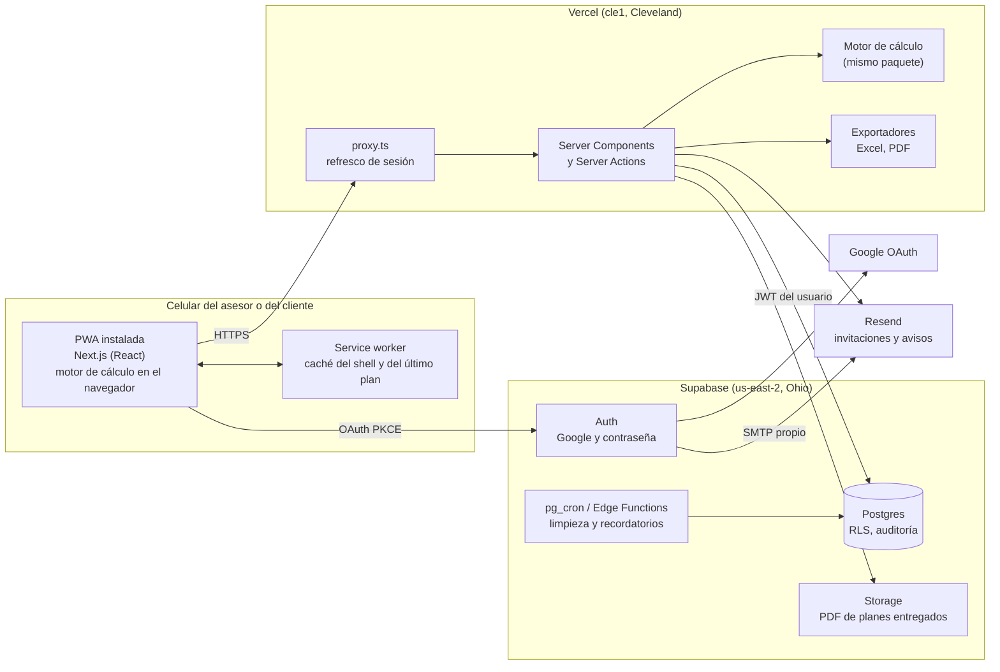
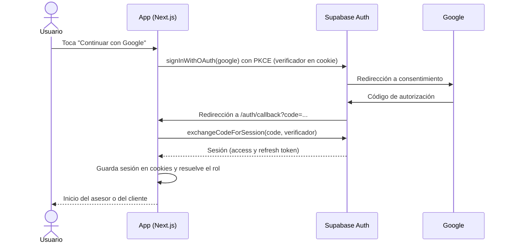
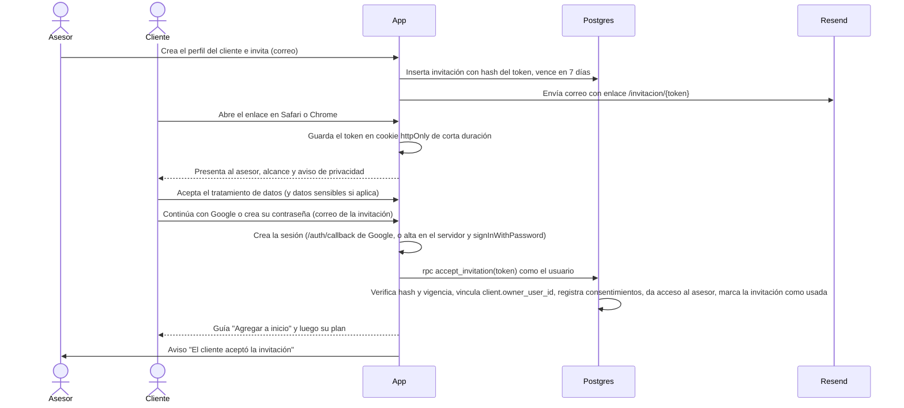
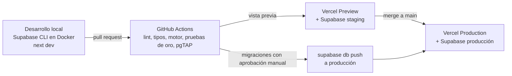

# 02. Arquitectura

## 1. Requisitos que guían la decisión

| Requisito | Origen | Consecuencia técnica |
|---|---|---|
| Web mobile-first instalable, sin tiendas | Decisión tomada | PWA con manifiesto, service worker, áreas seguras e instalación guiada |
| Google y correo con contraseña; Apple aplazado | Decisión del 28/09/2026 (ADR 0009); el encargo pedía Google y Apple | Supabase Auth con OAuth de Google y con contraseña; registro público cerrado, alta solo por invitación |
| Supabase como base | Decisión tomada | Postgres con RLS como única fuente de autorización |
| El cliente es dueño de sus datos | Sección 4.3 del encargo | Invitación, consentimiento, historial, exportación, borrado y revocación desde el modelo de datos |
| Cálculos idénticos a la plantilla (±0,01) | Sección 5 del encargo | Motor puro en TypeScript, con doble precisión, compartido entre navegador y servidor |
| Colombia y España hoy, cualquier país y varias monedas por cliente | Contexto y decisión del 28/09/2026 | Moneda por importe con selector, tasas por cliente, formatos, parámetros y módulos por país |
| Seguro antes que gratis | Sección 6 del encargo | Planes pagados desde que haya datos reales (copias de seguridad, sin pausa por inactividad) |
| Conexión lenta, una mano | Sección 6 del encargo | Renderizado en servidor, JavaScript mínimo por pantalla, navegación inferior, formularios cortos por paso |
| Un asesor hoy, varios mañana | Decisión tomada | Tabla de asesores y relación asesor-cliente desde el primer día |

## 2. Opciones comparadas

| Criterio | A. Next.js en Vercel + Supabase | B. SvelteKit en Vercel o Cloudflare + Supabase | C. SPA (Vite + React) en Cloudflare Pages + Supabase | D. Next.js en servidor propio + Supabase |
|---|---|---|---|---|
| Integración documentada con Supabase Auth en servidor | Guía oficial con `@supabase/ssr` y cookies [F17] | Guía oficial también existe | Solo cliente: la sesión vive en el navegador | Igual que A |
| Renderizado en servidor para conexión lenta | Sí (Server Components) | Sí | No: descarga toda la app antes de mostrar | Sí |
| Acciones de servidor para guardar y registrar el impacto de cambios | Sí (Server Actions) | Sí (form actions) | Requiere funciones aparte | Sí |
| Ecosistema de componentes accesibles y librerías (Excel, PDF, formularios) | El más amplio | Menor | Amplio | El más amplio |
| Operación para una sola persona | Baja: despliegue por git, vistas previas | Baja | Muy baja | Alta: servidor, parches, certificados, copias |
| Costo con uso comercial | Vercel Pro 20 USD al mes [F11][F12] | Cloudflare tiene plan gratuito generoso; Vercel igual que A | Bajo | Servidor desde unos pocos USD, más tiempo de operación |
| Riesgo de dependencia de proveedor | Medio (Vercel); Next.js se puede alojar en otros sitios | Bajo | Bajo | Bajo |

**Recomendación: opción A.** Next.js 16 con App Router en Vercel, sobre Supabase. Es la combinación con más documentación oficial para autenticación en servidor con cookies (clave para la PWA de iOS, sección 5), permite renderizar en servidor para conexiones lentas y reduce la operación a casi cero. Si más adelante el costo o la dependencia de Vercel importan, el mismo código se puede mover a otro alojamiento compatible con Next.js sin tocar el motor ni la base de datos.

Vercel Hobby no sirve para producción: sus condiciones excluyen el uso comercial, que incluye "anunciar la venta de un producto o servicio" y cualquier ganancia económica de quien participe en el proyecto [F12]. Una plataforma de un asesor profesional encaja en uso comercial aunque sea gratuita para el cliente. **Supuesto:** se usará Pro desde que haya clientes reales.

## 3. Vista general

### 3.1 Decisiones de diseño

1. **Todas las escrituras pasan por acciones de servidor.** La acción valida con el esquema de `packages/domain`, escribe con el cliente de Supabase del usuario (así RLS se aplica igual), recalcula con el motor y registra el impacto (antes y después). Los disparadores de auditoría en Postgres garantizan el historial aunque alguien escriba por otra vía.
2. **Lecturas en Server Components.** La primera pantalla llega renderizada, lo que ayuda con conexión lenta.
3. **El motor corre en los dos lados.** En el navegador, para recalcular al instante mientras se edita (vista previa). En el servidor, para las cifras oficiales: impacto de cambios, planes entregados y exportaciones.
4. **La base de datos es la autoridad de permisos.** La interfaz oculta lo que el usuario no puede editar, pero la decisión la toman RLS y los disparadores de guarda de columnas (ver `03-modelo-de-datos.md`).
5. **La clave `service_role` solo existe en el servidor** y solo la usan tareas administrativas acotadas (limpieza de cuentas huérfanas, borrado a pedido).

## 4. Pila técnica propuesta

Versiones fijadas en la fase 0 (28/09/2026): Node.js 24 LTS, pnpm 12.6, Next.js 16.3.6, React 19.2, TypeScript 6.0 (la 7.0 todavía no es compatible con `typescript-eslint`), ESLint 9 (la configuración de Next.js aún no está preparada para ESLint 10), Tailwind CSS 4.3, Vitest 5, Playwright 1.63, `@supabase/ssr` 0.12.

| Capa | Elección | Por qué |
|---|---|---|
| Lenguaje | TypeScript en todo el repositorio | Tipos compartidos entre motor, app y exportadores |
| Monorepo | pnpm workspaces + Turborepo | Paquetes con responsabilidad única y compilación incremental |
| Framework | Next.js 16, App Router, `proxy.ts` [F15] | Sección 2 |
| Estilos | Tailwind CSS con variables CSS generadas desde los tokens | Tokens en un solo lugar (`packages/ui`) |
| Componentes base | Primitivas accesibles sin estilo (por ejemplo, Radix UI) | Accesibilidad de diálogos, menús y selectores resuelta |
| Formularios | React Hook Form + zod | Validación compartida con el servidor |
| i18n | next-intl, con formatos `Intl` por país | Español primero, preparado para más idiomas |
| Service worker | Serwist (sucesor de next-pwa) | Caché del shell y precarga |
| Autenticación | Supabase Auth + `@supabase/ssr` (PKCE, cookies) [F17] | Sesión compartida entre servidor y navegador |
| Correo | Resend como SMTP de Supabase y para correos propios [F14][F25] | El correo incluido de Supabase no es para producción |
| Excel | ExcelJS sobre una copia de la plantilla | Exportación compatible celda a celda |
| PDF | @react-pdf/renderer | Funciona en funciones sin servidor, sin navegador embebido |
| Pruebas | Vitest (motor y componentes), Playwright (extremo a extremo), pgTAP (RLS) | Cada capa con su herramienta |
| Errores | Sentry con depuración de datos personales (fase 8) | Diagnóstico sin exponer datos de clientes |

## 5. Autenticación

### 5.1 Google

Requisitos: proyecto en Google Cloud, pantalla de consentimiento "External" en producción, alcances `openid`, `email` y `profile`. Con solo alcances no sensibles no se exige verificación de la app, pero para mostrar nombre y logo hace falta la verificación de marca, que tarda 2 a 3 días hábiles [F27].

### 5.2 Correo y contraseña

Decisión y detalle en el ADR 0009. Resumen:

| Tema | Regla |
|---|---|
| Alta | Solo desde una invitación vigente: el servidor verifica el token y crea la cuenta con `auth.admin.createUser` (correo de la invitación, `email_confirm: true`) usando la clave secreta. No hay segundo correo de confirmación, porque el token ya llegó a ese buzón |
| Registro público | Cerrado con el gancho "antes de crear usuario" (`private.before_user_created`), que solo deja pasar las altas con Google [F24]. `[auth.email] enable_signup = false` no sirve: apaga también el inicio de sesión (verificado en local) |
| Inicio de sesión | `signInWithPassword` desde un formulario de la app. No sale de la app instalada, así que no tiene el problema de la sección 5.4 |
| Recuperación | Código de 6 dígitos por correo (`{{ .Token }}`), escrito dentro de la app, y luego la nueva contraseña. No se usa enlace: se abriría en Safari y no en la app instalada [F4][F35] |
| Política | Mínimo de 8 caracteres (decisión E5 del asesor; el NIST pide 15 si es el único factor), máximo de al menos 64, sin reglas de composición, rechazo de contraseñas filtradas en Pro [F34][F36] |
| Abuso | Límites de intentos por IP de Supabase Auth; CAPTCHA (Turnstile) si aparecen ataques |
| Almacenamiento | Supabase Auth guarda solo un hash bcrypt [F34]; MiLuca no tiene columnas de contraseña ni las escribe en registros |
| Asesor | Entra con Google, con verificación en dos pasos en su cuenta de Google, mientras MiLuca no tenga segundo factor (5.5) |

**Apple, aplazado.** Si se retoma, hacen falta la membresía de Apple Developer (99 USD al año) [F3], Services ID, clave `.p8` y regenerar el secreto cada 6 meses [F2]. La invitación por token (5.3) ya admite el correo oculto de Apple, así que no cambia el modelo.

### 5.3 Alta por invitación

- El token tiene 32 bytes aleatorios; en la base solo se guarda su hash. Un solo uso, vence a los 7 días (**Supuesto**), el asesor puede reenviar o revocar.
- Una cuenta que entra sin invitación queda sin acceso a datos ("Necesitas una invitación de tu asesor"). Una tarea diaria borra cuentas sin cliente vinculado después de 7 días.
- No hay enlace mágico. Los correos de invitación los envía la app, no `inviteUserByEmail` de Supabase, porque ese método crea la cuenta al invitar, antes del consentimiento, y su enlace inicia sesión en el navegador donde se abre (ADR 0005).
- Registro libre en el futuro: el mismo flujo sin token crea un cliente sin asesor. El modelo ya lo permite (un cliente puede no tener asesor). Se recomienda no abrirlo en el MVP (ver preguntas abiertas).

### 5.4 Sesión en la PWA de iOS

**El problema.** En iOS, una web agregada a la pantalla de inicio tiene su propio almacenamiento: no hereda las cookies ni el almacenamiento de Safari, y el usuario debe volver a autenticarse dentro de la app [F4]. La copia automática de cookies al instalar existe solo en Mac [F4][F5]. Además, si el flujo OAuth sale de la app hacia Safari, la sesión queda guardada en Safari y la app sigue sin sesión, que es el problema conocido.

**Qué garantiza Apple.** Los flujos OAuth hacia un dominio de terceros se abren dentro de la app "por heurísticas", y "los enlaces abiertos con `window.open` siempre se abren en la web app sin importar el alcance" [F4].

**Estrategia propuesta.**

1. **Primer ingreso en el navegador.** La invitación se acepta en Safari o Chrome, donde el flujo de redirección normal funciona. Allí se registra el consentimiento.
2. **Guía de instalación.** Después de aceptar, la app muestra cómo agregarla a inicio (pantalla P-C03 en `05-pantallas-y-flujos.md`).
3. **Primer arranque de la app instalada.** La app detecta el modo instalado (`display-mode: standalone` o `navigator.standalone`) y, sin sesión, muestra "Entrar con Google" y el formulario de correo y contraseña. El formulario no sale de la app; los pasos 4 y 6 aplican solo a Google.
4. **Inicio de sesión dentro de la app con `window.open`.** El botón abre con `window.open` una ruta propia (`/auth/start?provider=...`), que llama a `signInWithOAuth` en el servidor, guarda el verificador PKCE en una cookie y redirige al proveedor. El proveedor vuelve a `/auth/callback`, que intercambia el código y deja la sesión en cookies del almacenamiento de la app. Esa ventana termina en `/auth/listo`, que avisa a la principal con `BroadcastChannel` y se cierra; la principal recarga ya con sesión. Como respaldo, la principal revisa la sesión cada vez que vuelve a verse. La ruta de retorno y la marca de ventana viajan en cookies `HttpOnly` de 10 minutos, porque la URL de retorno registrada en Supabase debe ser exacta. Implementado en F1 y verificado en navegadores de escritorio (Chromium y WebKit); falta la prueba en iPhone real.
5. **Sesión larga y persistente.** Sesión en cookies con refresh token rotativo. El dominio propio de una app de pantalla de inicio está exento del límite de 7 días de almacenamiento de ITP [F9], y la app pide `navigator.storage.persist()`, que WebKit concede con más facilidad a apps instaladas [F8].
6. **Plan B, sin redirecciones.** Si la prueba en dispositivos muestra fallas, se usa el flujo de token de identidad: botón de Google Identity Services en modo ventana emergente, seguido de `signInWithIdToken` en Supabase.

**Prueba temprana obligatoria (fase 0).** Esta estrategia se valida en iPhone reales antes de construir pantallas. Criterios de aceptación:

- Con las dos versiones mayores más recientes de iOS y con Android y Chrome, el cliente entra con Google y con correo y contraseña dentro de la app instalada sin terminar en Safari, y recupera la contraseña con el código sin salir de ella.
- La sesión sobrevive a cerrar la app, reiniciar el teléfono y 14 días sin abrirla.
- Cerrar sesión en la app no afecta la sesión de Safari y viceversa (esperado y documentado para el usuario).

### 5.5 Segundo factor (mejora futura)

Fuera del MVP. Diseño para no rehacer nada: Supabase Auth ofrece factores TOTP, y el JWT incluye el nivel de autenticación (`aal`). Cuando se active para el asesor, las políticas RLS de escritura del asesor exigirán `aal2`, y la app pedirá el código al entrar al área del asesor. **Supuesto:** verificar la documentación vigente de MFA de Supabase al implementarlo.

### 5.6 Reglas de sesión

| Regla | Valor propuesto (Supuesto) |
|---|---|
| Duración del access token | La de Supabase por defecto (1 hora) |
| Cierre por inactividad del cliente | 60 días |
| Cierre por inactividad del asesor | 14 días |
| Reautenticación antes de acciones sensibles (exportar todo, borrar cuenta, revocar acceso) | Sí, sesión de menos de 10 minutos |

## 6. PWA

### 6.1 Limitaciones actuales en iOS y cómo se tratan

| Tema | Situación | Tratamiento |
|---|---|---|
| Instalación | No existe aviso automático de instalación en Safari; se hace desde Compartir, "Agregar a inicio". | Pantalla de guía con capturas por plataforma; en Android se usa el evento `beforeinstallprompt` |
| Almacenamiento | Separado de Safari [F4]. Desde iOS 17, la app instalada tiene la misma cuota que el navegador (hasta 60 % del disco por origen) [F8]. Exenta del límite de 7 días de ITP [F9]. | Cookies para la sesión; IndexedDB solo para la caché del último plan |
| Notificaciones | Push web desde iOS 16.4, solo si la app está instalada y el permiso se pide tras un toque del usuario [F6]; push declarativo desde iOS 18.4 [F7]. | MVP con correo. Push en una fase posterior, pedido desde un botón explícito |
| Sin conexión | Service worker disponible | Shell de la app y último plan entregado en caché, solo lectura. La edición requiere conexión (evita conflictos entre asesor y cliente) |
| Pantalla completa | `display: standalone` en el manifiesto | Barra de estado con el color del tema |
| Notch y barra de inicio | Requiere `viewport-fit=cover` | Márgenes con `env(safe-area-inset-top)` y `env(safe-area-inset-bottom)`, navegación inferior sobre la zona segura |
| Unión Europea | Apple quitó las apps de pantalla de inicio en la UE con iOS 17.4 y revirtió la decisión en marzo de 2024 [F10] | Riesgo regulatorio vigilado; la app funciona también como web normal en Safari |
| Navegadores mínimos | Next.js 16 soporta Safari 16.4 o superior [F15] | Mensaje de navegador no compatible por debajo de esa versión |

### 6.2 Manifiesto (resumen)

`name` y `short_name` "MiLuca", `display: standalone`, `start_url: /inicio`, `scope: /`, `theme_color` y `background_color` desde los tokens, iconos de 192 y 512 px con variante enmascarable, `apple-touch-icon` de 180 px e imágenes de inicio para iOS.

## 7. Región de datos y cumplimiento técnico

- **Región (decidida, ADR 0003):** el proyecto de Supabase ya creado está en **us-east-2 (Ohio)**, verificado contra los rangos publicados por AWS [F32]. Las funciones de Vercel se fijan en `cle1` (Cleveland), su región equivalente; por defecto Vercel usa `iad1` [F33]. La página de regiones de Supabase no dice si se puede cambiar después: **Supuesto**, no se puede sin migrar a un proyecto nuevo.
- **Colombia:** la SIC declaró a Estados Unidos país con nivel adecuado de protección (Circular Externa 5 de 2017) [F21].
- **España:** los datos de clientes residentes en la UE salen del Espacio Económico Europeo. La transferencia se apoya en el DPA de Supabase y su evaluación de impacto de transferencias [F23]; el responsable del tratamiento lo decide antes de cargar el primer cliente de España (A7). Si no lo acepta, se crea un segundo proyecto en la UE y este queda como staging.
- **Contratos:** aceptar el DPA de Supabase [F23] y el de Vercel y Resend; registrar a los tres como encargados en la política de privacidad.
- **Cifrado:** en tránsito con TLS (HTTPS obligatorio, HSTS). En reposo, el cifrado de disco del proveedor. **Supuesto:** confirmar en la documentación de seguridad de Supabase el algoritmo de cifrado en reposo.
- **Datos que no se guardan:** números de documento, cuenta, tarjeta y contraseñas de productos financieros. La contraseña de acceso a MiLuca la guarda Supabase Auth solo como hash (ADR 0009). Los bancos se identifican solo por nombre. Validaciones en la interfaz avisan si un campo de texto parece contener un número de cuenta o de tarjeta.
- **Copias de seguridad:** diarias con 7 días de retención en Pro [F1]. PITR (100 USD al mes) solo si el volumen lo justifica.

## 8. Despliegue

| Entorno | Base de datos | Datos | Plan |
|---|---|---|---|
| Local | Supabase CLI (Docker) | Semillas y casos anonimizados | Gratis |
| Staging | Segundo proyecto de Supabase (el plan gratuito permite 2), misma región | Solo casos anonimizados | Gratis (se pausa tras una semana sin uso, aceptable) [F1] |
| Producción | Proyecto Supabase ya creado, us-east-2, pasado a Pro antes del primer dato real | Datos reales | Pro [F1] |

Reglas:

- Las migraciones se escriben a mano en `supabase/migrations/`, se prueban en local y en staging, y se aplican a producción desde CI con aprobación manual.
- Ningún entorno distinto de producción recibe datos reales.
- Secretos (clave secreta de Supabase, secreto de OAuth de Google, clave de Resend) en las variables de entorno de Vercel y en el gestor de secretos de GitHub; nunca en el repositorio.

## 9. Operación

| Tarea | Frecuencia |
|---|---|
| Actualizar parámetros por país (salario mínimo, tasas, umbrales) con fuente y fecha | Al inicio de cada año y ante cambios normativos |
| Probar la restauración de una copia de seguridad en staging | Cada 3 meses |
| Revisar dependencias y avisos de seguridad (por ejemplo, las publicaciones de seguridad de Next.js [F16]) | Mensual |
| Borrar cuentas huérfanas y ejecutar borrados solicitados | Diario (automático) |
