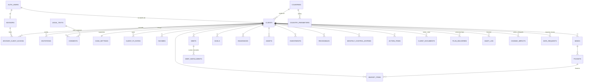

# 03. Modelo de datos

Borrador para Postgres en Supabase. Es una propuesta para revisar, no una migración lista (lo que ya está migrado y sus diferencias con este borrador están en la sección 11): los nombres de tablas y columnas están en inglés (ver [glosario.md](glosario.md)) y los valores de catálogo en español sin tildes, porque son los que se muestran al exportar.

## 1. Principios

1. **Todo cuelga de `client_id`.** Cada dato del cliente vive en una tabla con `client_id`, y todas las políticas RLS se resuelven con dos funciones: ¿es el dueño? ¿es un asesor con acceso activo?
2. **Datos vivos y planes entregados separados.** Las tablas normalizadas son los datos vivos. Cada plan entregado guarda una copia completa e inmutable de entradas, parámetros y resultados.
3. **Los resultados del motor no se guardan como datos vivos.** Se recalculan siempre. Solo se guardan en planes entregados, en la caché de cifras clave y en los registros de antes y después.
4. **Permisos por fila con RLS, por columna con disparadores.** RLS decide quién ve y edita cada fila. Los campos de criterio profesional dentro de una tabla editable por el cliente se protegen con un disparador de guarda.
5. **Historial completo.** Un disparador genérico registra cada inserción, cambio y borrado con autor, fecha y valores anteriores.
6. **Sin datos prohibidos.** No hay columnas para número de documento, cuenta, tarjeta ni contraseñas.
7. **Importes** en `numeric(18,2)`, tasas en `numeric(12,8)`, monedas ISO 4217 en `char(3)`. El motor los convierte a `number` al calcular.
8. **Multimoneda en todo** (decisión del 28/09/2026). Cada campo de dinero va acompañado de su moneda (columna `currency`, o `<campo>_currency` si la fila tiene varios importes). Por defecto es la moneda base del cliente y la interfaz muestra un selector. Las tasas viven en `client_fx_rates`; un disparador rechaza una moneda distinta de la base que no tenga tasa registrada.
9. **Países de forma general.** Cualquier país se puede habilitar con su moneda, formato y parámetros. Los módulos que dependen de reglas de un país (pensión, umbrales fiscales) solo existen donde se programaron; en los demás países, el módulo se muestra como "no disponible para este país" y el resto de la plataforma funciona igual.
10. **Cada caso es diferente** (decisión del 01/10/2026). Del país solo salen valores por defecto (moneda, formato, parámetros) y qué reglas existen. Lo que describe al cliente se guarda en sus propias filas y nunca se infiere del país: el pagador de cada gasto (`budget_items.payer`), si se analiza la pensión (`case_settings.pension_enabled`, apagado por defecto) y el tipo de cliente.

## 2. Diagrama de entidades (resumen)



## 3. Esquema SQL borrador

### 3.1 Identidad, acceso y consentimiento

```sql
create extension if not exists pgcrypto;
create extension if not exists btree_gist;
create schema if not exists private;   -- funciones de apoyo, no expuestas por la API

create table public.countries (
  code             char(2) primary key,              -- 'CO', 'ES'
  name             text not null,
  default_currency char(3) not null,                  -- 'COP', 'EUR'
  default_locale   text not null,                     -- 'es-CO', 'es-ES'
  pension_module   text check (pension_module in ('co', 'es_info')),
  enabled          boolean not null default true
);

create table public.advisors (
  id           uuid primary key default gen_random_uuid(),
  user_id      uuid not null unique references auth.users(id) on delete restrict,
  display_name text not null,
  brand_name   text,
  created_at   timestamptz not null default now()
);

create table public.clients (
  id                    uuid primary key default gen_random_uuid(),
  owner_user_id         uuid unique references auth.users(id) on delete set null, -- null hasta aceptar la invitación
  display_name          text not null,
  form_of_address       text not null default 'tu' check (form_of_address in ('tu', 'usted')),
  country_code          char(2) not null references public.countries(code),
  base_currency         char(3) not null,
  locale                text not null default 'es',
  birth_date            date,
  sex                   text check (sex in ('mujer', 'hombre')),
  client_type           text check (client_type in
                          ('empleado', 'contratista', 'independiente_variable', 'pensionado', 'rentista', 'mixto')),
  dependents_count      smallint not null default 0 check (dependents_count >= 0),
  status                text not null default 'borrador'
                          check (status in ('borrador', 'invitado', 'activo', 'borrado_solicitado')),
  created_by            uuid not null references auth.users(id),
  created_at            timestamptz not null default now(),
  updated_at            timestamptz not null default now(),
  deletion_requested_at timestamptz
);

create table public.advisor_client_access (
  advisor_id  uuid not null references public.advisors(id),
  client_id   uuid not null references public.clients(id) on delete cascade,
  status      text not null default 'active' check (status in ('active', 'revoked')),
  granted_at  timestamptz not null default now(),
  revoked_at  timestamptz,
  revoked_by  uuid references auth.users(id),
  primary key (advisor_id, client_id)
);

create table public.invitations (
  id          uuid primary key default gen_random_uuid(),
  client_id   uuid not null references public.clients(id) on delete cascade,
  advisor_id  uuid not null references public.advisors(id),
  email       text,                                  -- solo para enviar; se borra al aceptar
  token_hash  bytea not null unique,                 -- sha256 del token; el token nunca se guarda
  expires_at  timestamptz not null,
  accepted_at timestamptz,
  accepted_by uuid references auth.users(id),
  revoked_at  timestamptz,
  created_at  timestamptz not null default now()
);

create table public.legal_texts (
  id            uuid primary key default gen_random_uuid(),
  kind          text not null check (kind in
                  ('privacidad', 'terminos', 'tratamiento_datos', 'datos_sensibles', 'alcance_asesoria')),
  country_code  char(2) references public.countries(code),
  locale        text not null default 'es',
  version       text not null,
  body_markdown text not null,
  body_sha256   text not null,                       -- prueba de qué texto exacto se aceptó
  published_at  timestamptz not null,
  unique (kind, country_code, locale, version)
);

create table public.consents (
  id            uuid primary key default gen_random_uuid(),
  client_id     uuid not null references public.clients(id) on delete cascade,
  user_id       uuid not null references auth.users(id),
  legal_text_id uuid not null references public.legal_texts(id),
  granted       boolean not null,
  recorded_at   timestamptz not null default now(),
  withdrawn_at  timestamptz,
  user_agent    text
);
```

### 3.2 Parámetros por país, versionados

```sql
create table public.country_parameters (
  id           uuid primary key default gen_random_uuid(),
  country_code char(2) references public.countries(code),   -- null = parámetro de la metodología, común a todos
  key          text not null,        -- 'minimum_wage', 'retirement_age_female', 'dependent_income_limit', ...
  value        jsonb not null,       -- número, texto o tabla (por ejemplo, semanas requeridas por año)
  unit         text,                 -- 'COP', 'EUR', 'years', 'weeks', 'ratio'
  valid_from   date not null,
  valid_to     date,                 -- null = vigente
  source_name  text not null,
  source_url   text,
  consulted_at date not null,
  notes        text,
  created_by   uuid references auth.users(id),
  created_at   timestamptz not null default now(),
  check (valid_to is null or valid_to > valid_from),
  exclude using gist (
    coalesce(country_code, '--') with =,
    key with =,
    daterange(valid_from, valid_to) with &&
  )                                   -- sin periodos superpuestos para la misma clave
);

-- Valor vigente en una fecha (la de corte del cliente)
create function public.parameter_at(p_country char(2), p_key text, p_on date)
returns public.country_parameters
language sql stable set search_path = '' as $$
  select p.* from public.country_parameters p
  where p.key = p_key
    and (p.country_code = p_country or p.country_code is null)
    and p.valid_from <= p_on and (p.valid_to is null or p.valid_to > p_on)
  order by (p.country_code is null)          -- el del país gana sobre el común
  limit 1;
$$;
```

Ejemplos de claves iniciales:

| País | Clave | Valor | Fuente |
|---|---|---|---|
| CO | `minimum_wage` | 1.750.905 (2026) | Protocolo sección 14 [I1]; verificar con decreto oficial |
| CO | `pension.retirement_age` | `{"mujer": 57, "hombre": 62}` | Protocolo sección 8.6 |
| CO | `pension.required_weeks_female` | Tabla 2026 a 2036 | Protocolo sección 8.6 |
| CO | `social_security.independent_rates` | `{"salud": 0.125, "pension": 0.16, "arl_i": 0.00522}` | Protocolo sección 14 |
| CO | `social_security.contractor_base_ratio` | 0,40 | Protocolo sección 14 |
| ES | `retirement_age_reference` | 67 | Caso España; verificar con Seguridad Social |
| ES | `tax.dependent_income_limit` | 8.000 EUR | Art. 58 LIRPF [F30]; verificar |
| (común) | `method.pct_surplus_to_invest_confirmed` | 0,70 | Plantilla `Supuestos!C23` |
| (común) | `method.expensive_debt_threshold` | 0,20 | Plantilla `Supuestos!C22` |
| (común) | `method.emergency_months_by_client_type` | `{"empleado": 3, ...}` | Plantilla `Listas!H:I` |
| (común) | `method.semaphore_thresholds` | Umbrales del Resumen | Plantilla `Resumen!D` |

La tasa de cambio que recibe cada cliente no es un parámetro de país: es un dato del cliente (tabla `client_fx_rates`), porque el protocolo pide usar la que realmente recibe. Un parámetro de país puede guardar una tasa de referencia con fuente y fecha (`fx.reference.USD`), que la interfaz propone como valor inicial.

```sql
create table public.client_fx_rates (
  client_id    uuid not null references public.clients(id) on delete cascade,
  currency     char(3) not null,                -- moneda distinta de la base
  rate_to_base numeric(18,8) not null check (rate_to_base > 0), -- unidades de moneda base por 1 unidad de currency
  as_of        date not null,
  note         text,                            -- "la que te paga tu banco", "TRM del día"
  updated_by   uuid references auth.users(id),
  primary key (client_id, currency)
);

-- Cualquier tabla con importes llama a esta guarda antes de insertar o actualizar
create function private.check_currency()
returns trigger language plpgsql security definer set search_path = '' as $$
declare
  col text;
  cur char(3);
begin
  foreach col in array tg_argv loop
    cur := (to_jsonb(new) ->> col);
    if cur is not null
       and cur <> (select c.base_currency from public.clients c where c.id = new.client_id)
       and not exists (select 1 from public.client_fx_rates r
                       where r.client_id = new.client_id and r.currency = cur) then
      raise exception 'Falta la tasa de cambio de % para este cliente', cur using errcode = '23514';
    end if;
  end loop;
  return new;
end;
$$;
-- Ejemplo: create trigger debts_currency before insert or update on public.debts
--   for each row execute function private.check_currency('currency');
```

### 3.3 Supuestos del cliente (criterio del asesor)

```sql
create table public.case_settings (
  client_id                     uuid primary key references public.clients(id) on delete cascade,
  cutoff_date                   date not null default current_date,
  flow_year                     smallint not null,
  emergency_months_override     numeric(4,1),
  expensive_debt_threshold      numeric(12,8),
  pct_surplus_invest_confirmed  numeric(12,8),
  pct_surplus_invest_pending    numeric(12,8),
  pct_surplus_to_debt           numeric(12,8),
  pct_excess_to_invest          numeric(12,8),
  real_return_growth            numeric(12,8),
  real_return_stability         numeric(12,8),
  retirement_age                smallint,
  growth_glide_step             numeric(12,8),
  growth_floor                  numeric(12,8),
  operating_cushion             numeric(18,2) not null default 0,   -- en moneda base
  compatibility_mode            boolean not null default false, -- true = reproduce la plantilla 2.2 sin correcciones
  pension_enabled               boolean not null default false, -- lo activa el asesor por cliente; el país no lo decide
  updated_at                    timestamptz not null default now(),
  updated_by                    uuid references auth.users(id)
);
-- Columnas nulas = usar el parámetro vigente de country_parameters.
```

### 3.4 Datos de entrada del cliente

```sql
create table public.incomes (
  id                 uuid primary key default gen_random_uuid(),
  client_id          uuid not null references public.clients(id) on delete cascade,
  name               text not null,
  kind               text not null check (kind in ('laboral', 'renta', 'pension', 'otro')),
  currency           char(3) not null,
  amount             numeric(18,2) not null check (amount >= 0),
  is_net             boolean not null default true,
  payments_by_month  smallint[] not null default '{1,1,1,1,1,1,1,1,1,1,1,1}'
                       check (array_length(payments_by_month, 1) = 12),
  allocation         text not null default 'general' check (allocation in ('general', 'ahorro_total')),
  lost_in_scenario   text check (lost_in_scenario in ('a', 'b', 'c')),   -- modo nativo (H-07)
  note               text,
  sort_order         int not null default 0,
  updated_at         timestamptz not null default now(),
  updated_by         uuid references auth.users(id)
);

create table public.variable_income_history (       -- calculadora de ingreso base
  client_id   uuid not null references public.clients(id) on delete cascade,
  month_index smallint not null check (month_index between 1 and 12),
  amount      numeric(18,2) not null,
  primary key (client_id, month_index)
);

create table public.social_security_months (
  client_id         uuid primary key references public.clients(id) on delete cascade,
  payments_by_month smallint[] not null default '{1,1,1,1,1,1,1,1,1,1,1,1}'
);

create table public.banks (
  id             uuid primary key default gen_random_uuid(),
  client_id      uuid not null references public.clients(id) on delete cascade,
  name           text not null,                     -- solo el nombre de la entidad
  country_code   char(2) references public.countries(code),
  max_pockets    smallint,
  is_remunerated boolean not null default false,
  note           text
);

create table public.pockets (
  id              uuid primary key default gen_random_uuid(),
  client_id       uuid not null references public.clients(id) on delete cascade,
  bank_id         uuid references public.banks(id) on delete set null,
  kind            text not null default 'general' check (kind in ('emergencia', 'meses_sin_ingreso', 'general')),
  name            text not null,
  purpose         text,
  when_used       text,
  currency        char(3) not null,                 -- moneda del bolsillo (la de su cuenta)
  initial_balance numeric(18,2),                    -- solo para bolsillos generales; los otros dos se sugieren
  sort_order      int not null default 0,
  unique (client_id, name)
);

create table public.budget_items (
  id              uuid primary key default gen_random_uuid(),
  client_id       uuid not null references public.clients(id) on delete cascade,
  category        text not null,
  concept         text not null,
  currency        char(3) not null,                 -- por defecto la moneda base; selector en la interfaz
  amount          numeric(18,2),
  frequency       text check (frequency in ('semanal', 'quincenal', 'mensual', 'bimestral', 'trimestral',
                    'cada_4_meses', 'semestral', 'anual', 'cada_2_anos', 'por_duracion', 'meses_seguridad_social')),
  duration_days   numeric(8,2),
  expense_type    text check (expense_type in ('directo', 'bolsillo', 'seg_social', 'deuda', 'ahorro')),
  pocket_id       uuid references public.pockets(id) on delete set null,
  essential       boolean not null default false,
  payer           text not null default 'cliente' check (payer in ('cliente', 'familia', 'tercero')),
  payer_label     text,                             -- por ejemplo "sus padres"
  scope           text not null default 'presupuesto' check (scope in ('presupuesto', 'referencia_familiar')),
  is_temporary    boolean not null default false,   -- por ejemplo, la matrícula
  basic_amount    numeric(18,2),                    -- nivel básico, por pago, misma frecuencia y moneda; nulo = igual al actual; solo el asesor (guarda por disparador)
  is_proposed     boolean not null default false,   -- valor propuesto por el asesor (P5.3)
  note            text,
  sort_order      int not null default 0,
  updated_at      timestamptz not null default now(),
  updated_by      uuid references auth.users(id),
  constraint pocket_required check (expense_type is distinct from 'bolsillo' or pocket_id is not null)
);

create table public.debts (
  id                        uuid primary key default gen_random_uuid(),
  client_id                 uuid not null references public.clients(id) on delete cascade,
  name                      text not null,
  debt_type                 text check (debt_type in ('tarjeta_credito', 'libre_inversion', 'vehiculo', 'hipotecario',
                              'libranza', 'informal', 'otro')),
  lender_name               text,
  currency                  char(3) not null,        -- moneda del crédito; todos sus importes van en ella
  balance                   numeric(18,2) not null,
  annual_rate               numeric(12,8) not null,
  payment                   numeric(18,2),            -- cuota con seguros; si es nula se calcula con el plazo
  insurance_in_payment      numeric(18,2) not null default 0,
  first_installment_date    date,
  first_installment_number  int not null default 1,
  total_installments        int,
  original_amount           numeric(18,2),
  accepts_extra             boolean not null default true,
  extra_from_date           date,
  extra_from_installment    int,
  frech_points              numeric(12,8),
  frech_until_installment   int,
  manual_order              smallint,
  has_arrears               boolean not null default false,
  note                      text,
  sort_order                int not null default 0
);

create table public.debt_installments (        -- marcas de pago del cliente (plantilla de créditos)
  debt_id            uuid not null references public.debts(id) on delete cascade,
  client_id          uuid not null references public.clients(id) on delete cascade,
  installment_number int not null,
  paid               boolean not null default false,
  paid_on            date,
  custom_payment     numeric(18,2),             -- "cuota distinta este mes"
  extra_payment      numeric(18,2),             -- abono extra de ese mes
  primary key (debt_id, installment_number)
);

create table public.debt_strategy (
  client_id     uuid primary key references public.clients(id) on delete cascade,
  method        text not null default 'avalancha' check (method in ('avalancha', 'bola_de_nieve', 'manual')),
  extra_monthly numeric(18,2) not null default 0,
  currency      char(3) not null                    -- moneda del extra mensual
);

create table public.goals (
  id                   uuid primary key default gen_random_uuid(),
  client_id            uuid not null references public.clients(id) on delete cascade,
  name                 text not null,
  pocket_id            uuid references public.pockets(id) on delete set null,
  currency             char(3) not null,
  amount               numeric(18,2),
  uses_trip_calculator boolean not null default false,
  already_saved        numeric(18,2) not null default 0,
  repeat_every_years   numeric(4,1),
  target_date          date,
  note                 text
);

create table public.goal_cost_items (         -- calculadora de viaje en otra moneda
  id          uuid primary key default gen_random_uuid(),
  goal_id     uuid not null references public.goals(id) on delete cascade,
  client_id   uuid not null references public.clients(id) on delete cascade,
  concept     text not null,
  currency    char(3) not null,
  unit_value  numeric(18,2) not null,
  quantity    numeric(10,2) not null default 1,
  kind        text not null default 'item' check (kind in ('item', 'porcentaje_sobre_alojamiento', 'colchon', 'moneda_base'))
);

create table public.insurances (
  id                    uuid primary key default gen_random_uuid(),
  client_id             uuid not null references public.clients(id) on delete cascade,
  insurance_type        text not null,
  status                text check (status in ('si', 'no', 'cotizando')),
  beneficiaries_note    text,
  premium_currency      char(3),
  annual_premium_quoted numeric(18,2),
  note                  text
);

create table public.life_insurance_inputs (
  client_id        uuid primary key references public.clients(id) on delete cascade,
  support_years    numeric(4,1),              -- H-10: antes fijo en 10
  annual_to_cover  numeric(18,2),             -- nulo = gasto anual total
  currency         char(3)
);

create table public.assets (
  id                uuid primary key default gen_random_uuid(),
  client_id         uuid not null references public.clients(id) on delete cascade,
  name              text not null,
  asset_type        text not null check (asset_type in ('liquido', 'inmueble', 'vehiculo', 'otro')),
  currency          char(3) not null,
  value             numeric(18,2) not null,
  generates_income  boolean not null default false,
  pocket_id         uuid references public.pockets(id) on delete set null,
  note              text
);

create table public.investments (
  id          uuid primary key default gen_random_uuid(),
  client_id   uuid not null references public.clients(id) on delete cascade,
  name        text not null,                  -- plataforma o tipo, sin número de cuenta
  bucket      text check (bucket in ('crecimiento', 'estabilidad')),
  currency    char(3) not null,
  balance     numeric(18,2) not null,
  note        text
);

create table public.risk_profile (
  client_id           uuid primary key references public.clients(id) on delete cascade,
  drop_reaction       text check (drop_reaction in ('venderia', 'esperaria', 'invertiria_mas')),
  experience          text check (experience in ('ninguna', 'algo', 'bastante')),
  horizon             text check (horizon in ('menos_3', 'de_3_a_7', 'mas_7')),
  capacity_overrides  jsonb not null default '{}',   -- solo asesor (guarda por disparador)
  range_position      numeric(5,4) not null default 0.5 check (range_position between 0 and 1) -- solo asesor
);

create table public.pension_inputs (
  client_id     uuid primary key references public.clients(id) on delete cascade,
  country_code  char(2) not null references public.countries(code),
  schema_version smallint not null,           -- versión del esquema del módulo de ese país
  data          jsonb not null                -- CO: régimen, semanas, fecha, base en SM, hijos, descuento
);

create table public.receivables (
  id                  uuid primary key default gen_random_uuid(),
  client_id           uuid not null references public.clients(id) on delete cascade,
  debtor_label        text not null,          -- "hija", "amigo": sin nombre completo si no hace falta
  currency            char(3) not null,
  balance             numeric(18,2) not null,
  monthly_payment     numeric(18,2) not null,
  first_payment_date  date,
  pct_to_investment   numeric(12,8) not null default 1
);

create table public.reality_check (
  client_id          uuid primary key references public.clients(id) on delete cascade,
  currency           char(3) not null,          -- los dos saldos en la misma moneda
  savings_n_ago      numeric(18,2),
  n_months           smallint,
  savings_today      numeric(18,2)
);

create table public.monthly_control_entries (
  client_id   uuid not null references public.clients(id) on delete cascade,
  year        smallint not null,
  month       smallint not null check (month between 1 and 12),
  category    text not null,
  currency    char(3) not null,
  amount      numeric(18,2) not null,
  recorded_by uuid references auth.users(id),
  recorded_at timestamptz not null default now(),
  primary key (client_id, year, month, category)
);

create table public.action_items (
  id           uuid primary key default gen_random_uuid(),
  client_id    uuid not null references public.clients(id) on delete cascade,
  title        text not null,
  priority     text not null check (priority in ('alta', 'media', 'baja')),
  owner_role   text not null check (owner_role in ('cliente', 'asesor', 'contador', 'abogado', 'aseguradora',
                 'administradora_pensiones')),
  due_date     date,
  status       text not null default 'pendiente' check (status in ('pendiente', 'en_curso', 'hecho')),
  note         text,
  completed_at timestamptz,
  completed_by uuid references auth.users(id)
);

create table public.client_documents (       -- notas para el cliente, borrador de carta
  id           uuid primary key default gen_random_uuid(),
  client_id    uuid not null references public.clients(id) on delete cascade,
  kind         text not null check (kind in ('notas', 'carta')),
  status       text not null default 'borrador' check (status in ('borrador', 'publicado')),
  body         text not null,                -- Markdown con marcadores {{cifra:summary.annualSurplus}}
  updated_at   timestamptz not null default now(),
  updated_by   uuid references auth.users(id)
);
```

### 3.5 Planes entregados, cifras clave, historial y solicitudes

```sql
create table public.plan_deliveries (
  id                 uuid primary key default gen_random_uuid(),
  client_id          uuid not null references public.clients(id) on delete cascade,
  delivered_at       timestamptz not null default now(),
  delivered_by       uuid not null references auth.users(id),
  label              text not null,                 -- "Plan inicial", "Revisión 90 días"
  cutoff_date        date not null,
  engine_version     text not null,
  parameter_ids      uuid[] not null,               -- versiones exactas de parámetros usadas
  inputs             jsonb not null,                -- CaseInput completo
  results            jsonb not null,                -- CaseResult completo
  key_figures        jsonb not null,                -- cifras para comparar entre revisiones
  documents          jsonb not null,                -- notas y carta ya resueltas (con cifras, sin marcadores)
  qc_report          jsonb not null,                -- resultado del control de calidad
  pdf_path           text,                          -- Storage: deliveries/{client_id}/{id}.pdf
  sha256             text not null                  -- huella de inputs + results + documents
);

create table public.client_key_figures (           -- caché de las últimas cifras clave calculadas
  client_id      uuid primary key references public.clients(id) on delete cascade,
  computed_at    timestamptz not null,
  engine_version text not null,
  figures        jsonb not null
);

create table public.audit_log (
  id            bigint generated always as identity primary key,
  occurred_at   timestamptz not null default now(),
  actor_user_id uuid,
  actor_role    text check (actor_role in ('cliente', 'asesor', 'sistema')),
  client_id     uuid,                               -- sin FK: se borra aparte al suprimir datos
  table_name    text not null,
  row_pk        jsonb not null,
  action        text not null check (action in ('insert', 'update', 'delete')),
  old_values    jsonb,
  new_values    jsonb,
  changed_cols  text[]
);
create index on public.audit_log (client_id, occurred_at desc);

create table public.change_impacts (               -- tabla de antes y después
  id             uuid primary key default gen_random_uuid(),
  client_id      uuid not null references public.clients(id) on delete cascade,
  created_at     timestamptz not null default now(),
  actor_user_id  uuid references auth.users(id),
  actor_role     text not null,
  audit_from_id  bigint not null,
  audit_to_id    bigint not null,                   -- rango de cambios agrupados (ventana de 10 minutos)
  before_figures jsonb not null,
  after_figures  jsonb not null,
  deltas         jsonb not null,                    -- solo las cifras que cambiaron
  notified_at    timestamptz
);

create table public.notifications (
  id                uuid primary key default gen_random_uuid(),
  recipient_user_id uuid not null references auth.users(id) on delete cascade,
  client_id         uuid references public.clients(id) on delete cascade,
  kind              text not null,                  -- 'cambio_del_cliente', 'invitacion_aceptada', 'acceso_revocado'
  payload           jsonb not null,
  created_at        timestamptz not null default now(),
  read_at           timestamptz
);

create table public.data_requests (
  id           uuid primary key default gen_random_uuid(),
  client_id    uuid not null references public.clients(id) on delete cascade,
  kind         text not null check (kind in ('exportar', 'borrar')),
  requested_by uuid not null references auth.users(id),
  requested_at timestamptz not null default now(),
  status       text not null default 'pendiente' check (status in ('pendiente', 'procesando', 'hecho', 'cancelado')),
  completed_at timestamptz,
  result_path  text                               -- archivo de exportación (vence en 7 días)
);

create table public.deletion_receipts (             -- evidencia de borrado sin datos personales
  id              uuid primary key default gen_random_uuid(),
  client_id_hash  text not null,
  requested_at    timestamptz not null,
  completed_at    timestamptz not null
);
```

## 4. Funciones de apoyo para RLS

```sql
create function private.is_client_owner(p_client uuid)
returns boolean language sql stable security definer set search_path = '' as $$
  select exists (
    select 1 from public.clients c
    where c.id = p_client and c.owner_user_id = (select auth.uid())
  );
$$;

create function private.is_advisor_of(p_client uuid)
returns boolean language sql stable security definer set search_path = '' as $$
  select exists (
    select 1
    from public.advisor_client_access x
    join public.advisors a on a.id = x.advisor_id
    where x.client_id = p_client and x.status = 'active' and a.user_id = (select auth.uid())
  );
$$;

create function private.can_access(p_client uuid)
returns boolean language sql stable security definer set search_path = '' as $$
  select private.is_client_owner(p_client) or private.is_advisor_of(p_client);
$$;
```

Buenas prácticas aplicadas: `security definer` con `search_path` vacío, `(select auth.uid())` para que Postgres lo evalúe una vez por consulta, e índice en `client_id` en todas las tablas.

### 4.1 Patrones de política

**Tabla editable por cliente y asesor** (ingresos, presupuesto, deudas, metas, activos, inversiones, cobros, control mensual, prueba de realidad, bancos, bolsillos):

```sql
alter table public.incomes enable row level security;

create policy incomes_select on public.incomes for select to authenticated
  using (private.can_access(client_id));
create policy incomes_insert on public.incomes for insert to authenticated
  with check (private.can_access(client_id));
create policy incomes_update on public.incomes for update to authenticated
  using (private.can_access(client_id)) with check (private.can_access(client_id));
create policy incomes_delete on public.incomes for delete to authenticated
  using (private.can_access(client_id));
```

**Tabla de criterio del asesor** (supuestos, estrategia de deudas, documentos, plan de acción en creación):

```sql
create policy case_settings_select on public.case_settings for select to authenticated
  using (private.can_access(client_id));
create policy case_settings_write on public.case_settings for all to authenticated
  using (private.is_advisor_of(client_id)) with check (private.is_advisor_of(client_id));

-- Documentos: el cliente solo ve lo publicado
create policy documents_select on public.client_documents for select to authenticated
  using (private.is_advisor_of(client_id)
         or (private.is_client_owner(client_id) and status = 'publicado'));
```

**Guarda de columnas** (campos de criterio dentro de tablas que edita el cliente):

```sql
create function private.guard_advisor_columns()
returns trigger language plpgsql security definer set search_path = '' as $$
declare
  col text;
begin
  if private.is_advisor_of(new.client_id) then
    return new;
  end if;
  foreach col in array tg_argv loop
    if (tg_op = 'INSERT' and (to_jsonb(new) -> col) is not null and (to_jsonb(new) -> col) <> 'null'::jsonb)
       or (tg_op = 'UPDATE' and (to_jsonb(new) -> col) is distinct from (to_jsonb(old) -> col)) then
      raise exception 'El campo % solo lo puede cambiar el asesor', col using errcode = '42501';
    end if;
  end loop;
  return new;
end;
$$;

create trigger budget_items_guard before insert or update on public.budget_items
  for each row execute function private.guard_advisor_columns('basic_amount', 'is_proposed');
create trigger risk_profile_guard before insert or update on public.risk_profile
  for each row execute function private.guard_advisor_columns('capacity_overrides', 'range_position');
create trigger action_items_guard before insert or update on public.action_items
  for each row execute function private.guard_advisor_columns('title', 'priority', 'owner_role', 'due_date');
create trigger receivables_guard before insert or update on public.receivables
  for each row execute function private.guard_advisor_columns('pct_to_investment');
```

**Planes entregados**: lectura para dueño y asesor, inserción solo del asesor, sin políticas de `update` ni `delete` (inmutables). Un disparador rechaza cualquier `update`.

**Historial**: lectura para dueño y asesor; sin políticas de escritura. Solo lo escribe el disparador de auditoría (`security definer`).

**Acceso del asesor**: el asesor lee su fila; el dueño la lee y puede cambiar `status` (revocar o restablecer). Un disparador impide al asesor darse acceso a sí mismo; el acceso nace solo en `accept_invitation`.

### 4.2 Aceptar una invitación

```sql
create function public.accept_invitation(p_token text)
returns uuid language plpgsql security definer set search_path = '' as $$
declare
  inv public.invitations;
begin
  select * into inv from public.invitations
  where token_hash = extensions.digest(p_token, 'sha256')
    and accepted_at is null and revoked_at is null and expires_at > now()
  for update;
  if not found then
    raise exception 'Invitación no válida o vencida' using errcode = '22023';
  end if;
  if exists (select 1 from public.clients where owner_user_id = (select auth.uid())) then
    raise exception 'Esta cuenta ya está vinculada a otro perfil' using errcode = '23505';
  end if;
  update public.clients set owner_user_id = (select auth.uid()), status = 'activo' where id = inv.client_id;
  insert into public.advisor_client_access (advisor_id, client_id) values (inv.advisor_id, inv.client_id)
    on conflict (advisor_id, client_id) do update set status = 'active', revoked_at = null;
  update public.invitations set accepted_at = now(), accepted_by = (select auth.uid()), email = null
    where id = inv.id;
  return inv.client_id;
end;
$$;
```

Los consentimientos se registran en la misma transacción desde la acción de servidor (textos aceptados en la pantalla previa).

## 5. Matriz de permisos

"Ver" y "Editar" por rol. El asesor siempre necesita acceso activo concedido por el cliente. Autoridad: RLS y disparadores (sección 4).

| Área | Cliente ve | Cliente edita | Asesor ve | Asesor edita | Nota |
|---|---|---|---|---|---|
| Perfil: nombre visible, tratamiento, país, moneda base, tipo de cliente | Sí | No | Sí | Sí | País y tipo cambian reglas y módulos: criterio profesional |
| Perfil: fecha de nacimiento, sexo, personas a cargo | Sí | Sí | Sí | Sí | Datos de hecho |
| Supuestos y parámetros del caso (umbral, %, rendimientos, meses de fondo, edad de retiro, fecha de corte, modo compatible) | Sí | No | Sí | Sí | Criterio profesional |
| Monedas y tasas de cambio del cliente | Sí | Sí | Sí | Sí | Es un dato de hecho (la tasa que recibe); el historial muestra quién la cambió |
| Parámetros por país | Sí (los usados en su plan) | No | Sí | Sí | Con más asesores, pasa a un rol administrador |
| Ingresos e historia de ingreso variable | Sí | Sí | Sí | Sí | |
| Meses de pago de seguridad social | Sí | Sí | Sí | Sí | |
| Presupuesto: concepto, valor, frecuencia, tipo, bolsillo, esencial, pagador, alcance, temporal, nota | Sí | Sí | Sí | Sí | |
| Presupuesto: nivel básico y marca "propuesto" | Sí | No | Sí | Sí | Guarda de columnas |
| Bancos y bolsillos, saldos iniciales | Sí | Sí | Sí | Sí | |
| Deudas e inventario | Sí | Sí | Sí | Sí | |
| Marcas de pago de cuotas | Sí | Sí | Sí | Sí | |
| Método de pago de deudas y extra mensual | Sí | No | Sí | Sí | Criterio profesional |
| Metas y calculadora de viaje | Sí | Sí | Sí | Sí | |
| Seguros: ¿lo tiene?, beneficiarios, primas cotizadas | Sí | Sí | Sí | Sí | |
| Seguro de vida: años de apoyo, gasto a cubrir | Sí | No | Sí | Sí | Criterio profesional |
| Patrimonio e inversiones actuales | Sí | Sí | Sí | Sí | |
| Perfil de riesgo: respuestas 27a, 27b, 27c | Sí | Sí | Sí | Sí | |
| Perfil de riesgo: ajustes de capacidad y posición en el rango | Sí | No | Sí | Sí | Guarda de columnas |
| Pensión: datos del cliente | Sí | Sí | Sí | Sí | |
| Prueba de realidad: saldos | Sí | Sí | Sí | Sí | |
| Cuentas por cobrar: saldo, cuota, fecha | Sí | Sí | Sí | Sí | |
| Cuentas por cobrar: % a inversión | Sí | No | Sí | Sí | Guarda de columnas |
| Control mensual | Sí | Sí | Sí | Sí | |
| Plan de acción: crear, fechas, prioridad, responsable | Sí | No | Sí | Sí | |
| Plan de acción: estado y nota | Sí | Sí | Sí | Sí | El cliente marca sus tareas como hechas |
| Notas para el cliente y carta de cierre | Solo publicadas | No | Sí | Sí | |
| Planes entregados | Sí | No | Sí | Crear, nunca editar | Inmutables |
| Historial de cambios y antes y después | Sí | No | Sí | No | Solo lo escribe el sistema |
| Consentimientos | Sí | Otorgar y retirar | Sí | No | Del cliente |
| Acceso del asesor | Sí | Revocar y restablecer | Su propia fila | No | Del cliente |
| Invitaciones | No | No | Sí | Sí | |
| Exportación y borrado | Sí | Solicitar | Estado | No | |

## 6. Escenarios

| Tipo de escenario | Cómo se guarda | Fase |
|---|---|---|
| Niveles de costo de vida (esencial, básico, actual) | No son copias: el nivel esencial sale de la marca `essential`, el básico de `basic_amount` y el actual de `amount`. El motor calcula los tres a la vez. | MVP |
| Escenarios del fondo de emergencia (A, B, C) | Calculados por el motor; opcionalmente `incomes.lost_in_scenario` en modo nativo. | MVP |
| Escenarios de pensión (IBL bajo, medio, alto) | Calculados; entradas en `pension_inputs.data`. | Fase 6 |
| Sensibilidad a la tasa de cambio | Calculada. | Fase 3 |
| Simulaciones "qué pasa si" (comprar carro, cambiar de trabajo) | Tabla futura `what_if_scenarios (id, client_id, name, patch jsonb)`: un parche JSON sobre las entradas vivas; el motor aplica el parche y calcula. No duplica tablas. | Posterior al MVP |

## 7. Historial de cambios y tabla de antes y después

1. **Disparador de auditoría** en cada tabla del cliente: `after insert or update or delete`, escribe en `audit_log` el actor (`auth.uid()`), su rol (dueño o asesor), la fila anterior y la nueva, y las columnas que cambiaron. Se excluyen columnas técnicas (`updated_at`).
2. **Impacto:** cada acción de servidor que guarda datos llama, al terminar, a `recordImpact(clientId)`: lee `client_key_figures` (antes), recalcula con el motor (después), guarda la caché y, si cambió alguna cifra clave, crea o amplía un registro de `change_impacts`. Los cambios de un mismo actor en una ventana de 10 minutos se agrupan en un solo registro (**Supuesto**).
3. **Aviso:** si el actor es el cliente, se crea una notificación para el asesor con la tabla de antes y después; un resumen por correo se envía como máximo una vez al día (**Supuesto**).
4. **Cifras clave** (definidas en el motor): ingreso anual, gasto anual, ahorro programado, sobrante anual, tasa de ahorro, carga de deuda, deuda total, fecha de salida de la deuda cara, meta y avance del fondo, faltante de meses sin ingreso, inversión anual, % en crecimiento, patrimonio neto, costo de vida por nivel y estado de la prueba de realidad.

## 8. Planes entregados frente a datos vivos

- Entregar un plan ejecuta el control de calidad; si hay errores bloqueantes, no se puede entregar.
- La entrega guarda en `plan_deliveries` las entradas, los parámetros usados (por id), los resultados, las cifras clave, los documentos ya resueltos (las cifras reemplazan a los marcadores) y el PDF en Storage.
- La vista "Comparar con el plan entregado" muestra las cifras clave del plan elegido frente a las actuales.
- Nada modifica un plan entregado. Una corrección genera una nueva entrega.

## 9. Control del cliente sobre sus datos

| Derecho | Implementación |
|---|---|
| Acceso y portabilidad | Solicitud `exportar`: genera un JSON legible por máquina con todas sus filas y un Excel compatible; enlace firmado que vence en 7 días |
| Rectificación | Edición directa (matriz de permisos) |
| Supresión | Solicitud `borrar`: el perfil pasa a `borrado_solicitado` y deja de mostrarse; tras un plazo de gracia de 7 días (**Supuesto**, para poder cancelar), una tarea borra el cliente en cascada, sus filas de `audit_log`, sus archivos en Storage y su usuario de Auth, y deja un `deletion_receipt` sin datos personales |
| Revocar al asesor | `advisor_client_access.status = 'revoked'`: el asesor pierde el acceso al instante por RLS |
| Retirar el consentimiento | `consents.withdrawn_at`; equivale a pedir la supresión o a suspender el tratamiento, según el texto legal que apruebe el responsable (A7) |

Qué conserva el asesor tras la revocación o el borrado (por ejemplo, copia de los planes entregados por responsabilidad profesional) es una decisión legal abierta.

## 10. Almacenamiento de archivos

| Bucket | Privado | Ruta | Política |
|---|---|---|---|
| `deliveries` | Sí | `{client_id}/{delivery_id}.pdf` | Lectura si `private.can_access` del primer segmento de la ruta; escritura solo del servidor |
| `exports` | Sí | `{client_id}/{request_id}.zip` | Lectura solo del dueño; borrado automático a los 7 días |

## 11. Estado de la implementación

Las secciones 3 a 10 siguen siendo el diseño de referencia. Lo que ya existe como migración en `supabase/migrations/`, con sus pruebas en `supabase/tests/database/`:

| Migración | Contenido |
|---|---|
| `20260929025941_identity_access_audit.sql` | `countries` (Colombia y España), `advisors`, `clients`, `advisor_client_access`, `invitations`, `audit_log`; funciones de la sección 4; guarda de columnas en `clients`; historial en las cinco tablas; `create_client` y `accept_invitation` |
| `20260929025943_signup_hook.sql` | Gancho `private.before_user_created`: solo deja pasar las altas con Google (ADR 0009) |
| `20260929184227_invitation_consent.sql` | `legal_texts` y `consents` con RLS e historial; `current_legal_texts(país)`, `get_invitation(token)` y `accept_invitation(token, textos aceptados, navegador)`, que reemplaza a la versión anterior |
| `20260929190605_revoke_accept_invitation_anon.sql` | Quita a `anon` el permiso de ejecutar `accept_invitation` (punto 13) |
| `20260929200939_consent_withdrawal.sql` | El dueño retira su consentimiento de datos sensibles (punto 14) |
| `20260929201135_unclaimed_account_cleanup.sql` | `private.delete_unclaimed_accounts()` y su tarea diaria en `pg_cron` (punto 15) |
| `20260929202128_legal_texts_1_0.sql` | Avisos de privacidad y de datos de salud 1.0, Colombia y España (A7b), generados desde `docs/legal/textos/` |
| `20260929203237_notifications.sql` | `notifications` con RLS; aviso `invitacion_aceptada` al asesor (punto 16) |

Diferencias con el borrador de las secciones 3.1, 4 y 5:

1. **Privilegios por columna además de RLS.** `authenticated` solo puede escribir las columnas que la matriz le permite; `anon` no tiene acceso a ninguna tabla. Dueño, estado y autor de un perfil no se cambian desde la API.
2. **Los perfiles se crean con `create_client(nombre, país, moneda?, tratamiento?)`.** Crea el perfil y el acceso del asesor en la misma transacción. Con un `insert` directo, el asesor aún no tendría acceso y no podría leer la fila recién creada. La moneda base y el formato (`locale`) salen del país si no se indican.
3. **Invitaciones.** Desde la API solo se escriben `client_id`, `email` y `token_hash`; el asesor y el vencimiento (7 días, C4) los pone la base. Solo se invita a perfiles sin dueño. Una invitación se revoca una vez, con la fecha que pone la base, y no se reactiva.
4. **`accept_invitation`** usa `sha256` de Postgres (sin `pgcrypto`), rechaza cuentas de asesor (C11) y, al aceptar, revoca las demás invitaciones abiertas del perfil y borra su correo.
5. **Funciones de apoyo nuevas:** `private.current_advisor_id()`, `private.is_my_advisor(asesor)` (el cliente ve el nombre de su asesor) y `private.is_unclaimed(cliente)`.
6. **Historial.** `private.audit_row` recibe la columna del cliente y las columnas que no se copian: en `invitations`, el hash del token y el correo. Un cambio que solo toca `updated_at` no deja fila.
7. **Revocación.** La fecha y el autor de la revocación del acceso los pone un disparador. El dueño puede restablecer el acceso.
8. **Supuestos** anotados en `07-preguntas-abiertas.md`: el asesor borra solo perfiles sin dueño (C12) y el cliente no cambia su `locale` (C13).
9. **Textos legales.** Llevan `title` (P-C02 lo muestra). `body_sha256` lo calcula un disparador, porque `convert_to` no es inmutable y no sirve en una columna generada; el mismo disparador rechaza cambiar un texto publicado: una corrección es una versión nueva. `unique nulls not distinct` hace única también la combinación con `country_code` nulo (texto común). Se leen sin sesión (`anon`), porque P-C02 se ve antes de tener cuenta; nadie los escribe desde la API. La migración no carga textos: los aprueba el responsable y llegan en otra migración (A7, C15).
10. **Textos vigentes.** `current_legal_texts(país)` elige por tipo la versión publicada más reciente, la del país antes que la común. P-C02 y `accept_invitation` usan la misma función, así que se acepta exactamente lo que se mostró; si cambió entre medio, la aceptación falla con `23514` y la app vuelve a mostrar el texto.
11. **Consentimientos en la aceptación.** `accept_invitation` exige el texto de tratamiento de datos vigente del país (`23514` si falta, `55000` si el país no tiene uno) y registra en la misma transacción una fila por texto de P-C02: tratamiento (aceptado) y datos sensibles (aceptado o no). Nadie escribe consentimientos desde la API; retirarlos llega con P-C11, cuando el responsable defina qué implica (A7).
12. **`get_invitation(token)`**, `security definer` y abierta a `anon`: con el token devuelve el estado (`valid`, `used`, `revoked`, `expired`, `invalid`) y, solo si está vigente, el nombre del asesor, el del perfil, el trato, el país, el correo y el vencimiento. Sin el token no expone nada.
13. **Permisos de las funciones.** Supabase da `EXECUTE` a `anon` y `authenticated` directamente en cada función nueva de `public`, así que `revoke ... from public` no basta: cada función revoca y concede por rol. Sin sesión solo se ejecutan `get_invitation` y `current_legal_texts`; una prueba pgTAP lo vigila con la lista completa.
14. **Retiro de consentimientos.** `authenticated` puede escribir solo `consents.withdrawn_at`, y RLS solo al dueño. Un disparador exige que el texto sea de `datos_sensibles`, que se haya aceptado y que no se haya retirado antes, y pone la fecha. El tratamiento de datos general no se retira así: sin él no hay servicio, y eso es pedir el borrado (F7).
15. **Cuentas sin perfil.** `private.delete_unclaimed_accounts(7 días)` borra de `auth.users` las cuentas de más de 7 días que no son de un asesor, no son dueñas de un perfil, no crearon perfiles y no tienen consentimientos. Corre cada día a las 08:00 UTC con `pg_cron` (`cron.job`, `delete-unclaimed-accounts`). Solo la ejecuta la base.
16. **Avisos.** `notifications` sigue la sección 3 con `kind` limitado por ahora a `invitacion_aceptada` y `payload` vacío: el nombre del cliente se lee con RLS al mostrarlo, así que deja de verse si el cliente retira el acceso. Los crea un disparador de `invitations` cuando se pone `accepted_at`; cada usuario ve y marca como vistos solo los suyos, y la fecha de lectura la pone la base.

Sin pendientes de F1 en el modelo de datos.
