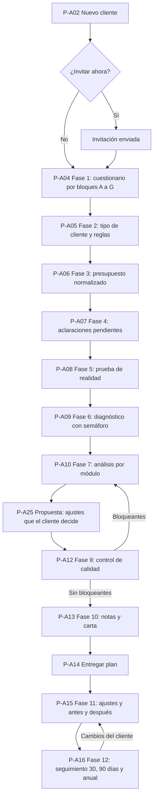
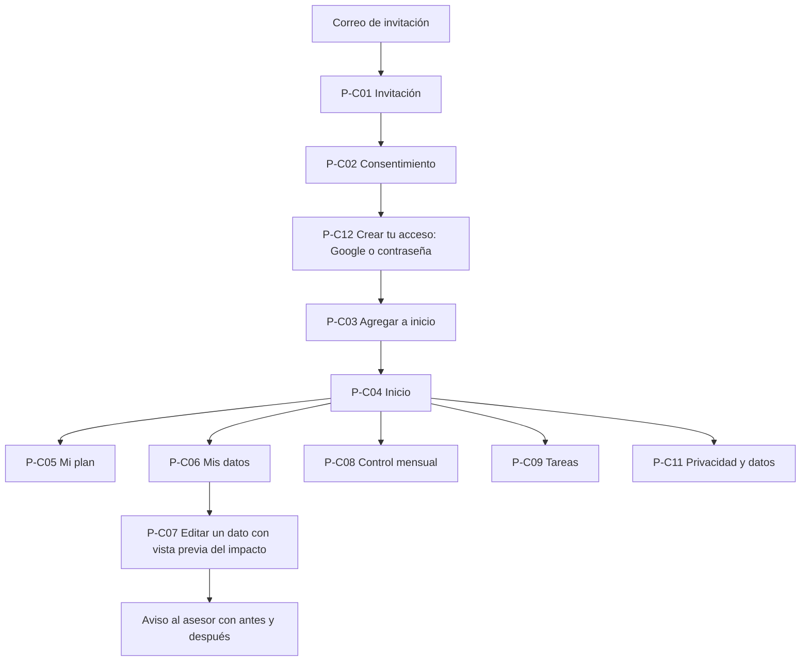

# 05. Pantallas y flujos

## 1. Principios de diseño

| Principio | Cómo se aplica |
|---|---|
| Una mano | Acciones principales abajo (botón fijo sobre la navegación inferior); formularios en hojas que suben desde abajo; nada importante en la esquina superior |
| Objetivos táctiles | Mínimo 44 x 44 puntos, por encima del mínimo de 24 x 24 px de WCAG 2.2 [F31] |
| Formularios cortos | Un bloque por pantalla; guardado por bloque; nunca un formulario de 20 campos |
| Números | Teclado decimal (`inputmode="decimal"`), formato de moneda del país al salir del campo, tamaño de fuente de 16 px o más en campos para que Safari no haga zoom |
| Monedas | Cada campo de dinero tiene un selector de moneda pegado al importe: primero la moneda base, luego las que el cliente ya usa y al final un buscador de todas las monedas ISO 4217. Si la moneda no tiene tasa, el formulario pide la tasa en el mismo paso. Las listas muestran el importe original y los totales en moneda base |
| Semáforo accesible | Color, icono y texto a la vez ("Bien", "Atención", "Alerta"); el color nunca es el único medio [F31] |
| Conexión lenta | Primera vista renderizada en servidor, esqueletos de carga, sin imágenes pesadas, JavaScript por ruta |
| Sin conexión | Aviso visible; el último plan entregado se puede leer; la edición espera la conexión |
| Claridad profesional | Cada proyección dice "Ilustrativa, no garantizada"; cada tema de impuestos, pensión o sucesión muestra a qué profesional se remite |
| Moneda de hoy | Etiqueta fija "Cifras en pesos de hoy" o "Cifras en euros de hoy" en resúmenes y proyecciones |
| Tema | Claro y oscuro con los tokens de [diseno/tokens.md](diseno/tokens.md) |
| Todos los dispositivos | Primero el celular. Desde 768 px, columna de lectura de 672 px y botones de la barra fija en fila a la derecha; desde 1024 px, las pantallas de resumen ponen en rejilla los elementos pares (ADR 0023) |
| Dos idiomas | Español e inglés con los mismos textos; cada persona elige en Entrar, la invitación, su inicio o Privacidad y datos (el asesor, en Clientes). Cifras con el formato del país en los dos (ADR 0022) |

## 2. Navegación

**Cliente** (barra inferior de 5 destinos):

```
┌────────────────────────────────────────────┐
│  Inicio   Mi plan   Mis datos   Control  Más │
└────────────────────────────────────────────┘
```

"Más" agrupa: Tareas, Créditos (si tiene), Historial, Privacidad y datos, Cerrar sesión.

**Asesor** (barra inferior de 4 destinos): Clientes, Avisos, Parámetros, Cuenta. Dentro de un cliente, la barra cambia a: Resumen, Datos, Análisis, Entrega, Más, con la fase actual visible arriba.

## 3. Flujo del asesor: una asesoría completa

### 3.1 Asesoría en tres etapas (ADR 0025)

El asesor no pide todo de una vez. Primero llena el núcleo (perfil, ingresos, monedas y supuestos) y después trabaja una etapa a la vez, cada una con su propio reporte:

| Etapa | Qué se registra | Qué recibe el cliente |
|---|---|---|
| Datos básicos (núcleo, siempre activo) | Perfil y tipo de cliente; ingresos con su tipo | Nada aparte: lo usan las tres etapas |
| 1. Presupuesto y bolsillos | Gastos (desde el catálogo), bancos y bolsillos, prueba de realidad; si aplican, meses sin ingreso y cobros | Reporte con ingreso, gasto, sobrante, tasa de ahorro, fondo de emergencia, aporte de cada bolsillo y el año del flujo |
| 2. Deudas | Saldo, tasa y cuota de cada deuda | Reporte con deuda total, carga de deuda, orden de pago, salida de cada deuda e intereses |
| 3. Patrimonio, protección y metas | Patrimonio, seguros, metas y perfil de riesgo | Reporte con patrimonio neto, suma asegurada, aporte a cada meta e inversión ilustrativa |

En la ficha (P-A03), cada etapa activa muestra sus pasos, que se marcan solos con los datos, y el primero pendiente como acción principal. El orden sugerido es 1, 2, 3; un cliente que llega por sus deudas puede empezar por la 2. Con deuda cara, la etapa 3 avisa que la inversión espera. Ocultar una etapa no borra sus datos ni los saca del cálculo. Para cada etapa se sigue el mismo ciclo del protocolo: registrar, analizar, proponer, controlar, entregar y hacer seguimiento.

### 3.2 Fases del protocolo



La fase 8 del protocolo (llenar el Excel) desaparece: los datos viven en la plataforma y el Excel es una exportación (P-A18).

| Fase del protocolo | Pantalla | Qué hace el asesor |
|---|---|---|
| 1. Cuestionario | P-A04 | Captura por bloques A a G durante o después de la entrevista. Cada campo acepta "estimado" y "por confirmar" |
| 2. Tipo de cliente | P-A05 | Elige tipo; la pantalla muestra las reglas que se aplican (meses de fondo, ingreso base, prima, cesantías) |
| 3. Procesamiento | P-A06 | Revisa el presupuesto normalizado, clasifica, marca esenciales y pagador |
| 4. Aclaraciones | P-A07 | Ve los campos "por confirmar" y el banco de preguntas; copia un mensaje numerado para enviar al cliente |
| 5. Prueba de realidad | P-A08 | Escribe saldos de hace N meses y de hoy; ve el estado y el % a inversión que resulta |
| 6. Diagnóstico | P-A09 | Revisa indicadores con semáforo; escribe fortalezas y puntos de atención |
| 7. Análisis | P-A10, P-A11 | Flujo, bolsillos, fondo, deudas, metas, seguros, inversión, cobros, costo de vida, lista para contador y abogado (la pensión se remite al profesional, ADR 0016) |
| 7. Análisis (recomendaciones) | P-A25 | Arma la propuesta: ajustes a los gastos con su porqué, comparados con el plan de hoy; anota qué acepta el cliente y aplica lo aceptado, que crea sus tareas; lo pendiente sigue en una propuesta nueva (ADR 0024) |
| 9. Control de calidad | P-A12 | Ve bloqueantes y advertencias; justifica advertencias con nota |
| 10. Carta de cierre | P-A13 | Redacta notas y carta con cifras enlazadas; previsualiza como el cliente |
| Entrega | P-A14 | Congela la versión, genera el PDF y avisa al cliente |
| 11. Ajustes | P-A15 | Ve la tabla de antes y después de cada cambio (suyo o del cliente) |
| 12. Seguimiento | P-A16 | Compara con el plan entregado, programa revisiones, genera la ficha de continuidad |

## 4. Flujo del cliente



## 5. Lista de pantallas

### 5.1 Generales

| Id | Pantalla | Contenido |
|---|---|---|
| P-G01 | Entrar | Marca, "Continuar con Google", formulario de correo y contraseña (permite pegar y gestores de contraseñas), enlace "Olvidé mi contraseña", texto "El acceso es por invitación de tu asesor", enlaces a privacidad y términos |
| P-G02 | Sin invitación | Explica que la cuenta existe pero no tiene perfil; opción de cerrar sesión; la cuenta se borra en 7 días |
| P-G03 | Navegador no compatible | Versión mínima (Safari 16.4 [F15]) y cómo actualizar |
| P-G04 | Sin conexión | Qué se puede ver y qué no |
| P-G05 | Recuperar contraseña | Tres pasos: correo, código de 6 dígitos recibido por correo y nueva contraseña. Todo dentro de la app. El mensaje es el mismo exista o no la cuenta, para no revelar qué correos están registrados (ADR 0009) |
| P-G06 | Landing (`/` sin sesión, ADR 0026) | Página pública para quien llega por recomendación: cabecera con la marca y Entrar; presentación con el título, los dos botones de contacto (Escríbeme por WhatsApp y Pedir una primera conversación, cada uno con su mensaje) y la línea de confianza; cómo funciona con las tres etapas; tres capturas de la app con un caso inventado; cómo trabajo; sobre mí; tus datos y los límites con el enlace al aviso; cinco preguntas plegables; cierre con el botón de WhatsApp; pie con el alcance, el aviso de privacidad, Entrar, el correo del responsable y el idioma. En el escritorio, el título de cada sección a la izquierda y el contenido a la derecha. Sin formularios ni analítica, y sin hablar de precio. Con sesión, `/` sigue al inicio de cada rol |
| P-G07 | Privacidad pública (`/privacidad`, ADR 0026) | Los avisos vigentes de cada país habilitado (tratamiento de datos y datos de salud), con versión y fecha, como en P-C02; el correo del responsable para consultar, corregir o borrar. Abre con o sin sesión; los avisos existen solo en español y en inglés se avisa |

### 5.2 Cliente

| Id | Pantalla | Contenido |
|---|---|---|
| P-C01 | Invitación | Nombre del asesor, qué es la plataforma (planificación y educación financiera), qué no es (no recomienda productos), qué datos se piden y cuáles nunca, botón continuar |
| P-C02 | Consentimiento | Texto de tratamiento de datos del país (versión y fecha), casilla obligatoria; casilla aparte para datos de salud si el presupuesto los incluye; enlace a la política completa |
| P-C03 | Agregar a inicio | Instrucciones según el sistema: en iPhone, Compartir y luego "Agregar a inicio"; en Android, botón "Instalar" (evento `beforeinstallprompt`). Opción "Ahora no" |
| P-C04 | Inicio | Saludo con el tratamiento elegido; si el plan está listo o en preparación, con el enlace a Mi plan (o a las notas publicadas antes de la entrega); botón "Registrar el gasto de este mes"; próximas 3 tareas; enlaces a Mis datos y a Privacidad y datos; idioma; cerrar sesión. Las 4 cifras clave con semáforo del boceto de abajo no están construidas (08/10/2026) y no entran antes del piloto |
| P-C05 | Mi plan | Con reportes de varias etapas, arriba el último de cada una (ADR 0025); el reporte elegido muestra solo las secciones de su etapa. Plan entregado vigente por secciones plegables (estructura de la carta, sección 11 del protocolo); selector de versión; botón "Comparar con hoy"; descargar PDF. Incluye los supuestos con que se calculó, en solo lectura, cada uno con su ayuda (la misma vista la ve el asesor) |
| P-C06 | Mis datos | Módulos editables con su total, agrupados en datos básicos (Ingresos, Monedas) y las etapas que el asesor activó: presupuesto (Gastos, Bancos y bolsillos, Lo que le deben, Prueba de realidad), deudas y patrimonio (Lo que tiene, Seguros, Metas, Inversión) (ADR 0025) |
| P-C07 | Editar un dato | Hoja inferior con el formulario; debajo, "Así cambia tu plan" con las cifras clave antes y después, calculadas en el teléfono |
| P-C08 | Control mensual | Selector de mes; por categoría: presupuesto, campo del gasto real, barra de desviación; total del mes |
| P-C09 | Tareas | Lista del plan de acción; tocar para marcar hecha; filtro pendientes y hechas |
| P-C10 | Créditos | Tarjeta por crédito con próxima cuota, fecha y estado; marcar pagada con fecha; panel con deuda total y fecha de libertad |
| P-C11 | Privacidad y datos | Exportar mis datos, pedir borrado, retirar o restablecer el acceso del asesor, ver consentimientos, cerrar sesión |
| P-C12 | Crear tu acceso | Después del consentimiento: "Continuar con Google" o "Crear contraseña" con el correo de la invitación fijo, contraseña con indicador de longitud mínima y opción de mostrarla (ADR 0009) |
| P-C12 | Historial | Cambios por fecha, quién los hizo y su efecto en las cifras |

### 5.3 Asesor

| Id | Pantalla | Contenido |
|---|---|---|
| P-A01 | Clientes | Buscador; tarjetas con nombre, país, estado (borrador, invitado, activo), fase actual, próxima revisión, marca de cambios nuevos |
| P-A02 | Nuevo cliente | Nombre visible, país (define moneda y módulos), tú o usted, correo para la invitación (opcional) |
| P-A03 | Ficha del cliente | Datos básicos y las tres etapas con sus pasos, el siguiente paso como acción principal, sus pantallas y activar u ocultar; carta y entrega; seguimiento; cifras de las etapas activas; invitación (ADR 0025) |
| P-A04 | Cuestionario por bloques | Pasos A a G; en cada campo, marca "estimado" y "por confirmar" |
| P-A05 | Tipo de cliente | Selector y reglas que se activan |
| P-A06 | Presupuesto | Partidas agrupadas por categoría con total mensual; icono en filas incompletas; alta rápida; filtros por tipo, pagador y esencial |
| P-A24 | Asistente (botón flotante) | En todas las pantallas de un cliente, solo para el asesor (ADR 0017). Abre un chat: el asesor escribe lo que cuenta el cliente y el agente lo anota en el plan con las reglas de cada pantalla; cada guardado aparece como una tarjeta con Ver y Deshacer, y pregunta lo que falte. No calcula ni recomienda productos. En el celular ocupa la pantalla; en escritorio queda abajo a la derecha. La conversación no se guarda |
| P-A06b | Gastos típicos | Catálogo del país por categoría (`packages/i18n/src/budget-catalog/`): se marca lo que el cliente gasta, con valor opcional (y días si va por duración); lo marcado se guarda con la frecuencia, el tipo, el bolsillo y el esencial sugeridos, y el bolsillo que falta se crea. Lo que ya está se ve sin casilla. Al final, recordatorio de lo que más se olvida (protocolo, prueba de realidad). Es el punto de partida con el presupuesto vacío. El cliente la tiene en Mis gastos. Solo para el asesor, el asistente con Claude (ADR 0012): notas escritas o dictadas, propuesta con la cita de cada gasto, y "Marcar en la lista" sin guardar |
| P-A07 | Aclaraciones | Campos por confirmar y preguntas sugeridas; "Copiar mensaje" |
| P-A08 | Prueba de realidad | Tres campos, resultado y efecto en el % a inversión |
| P-A09 | Diagnóstico | Indicadores con semáforo; campos de fortalezas y puntos de atención |
| P-A10 | Análisis | Pestañas: Flujo, Bolsillos, Fondo, Deudas, Metas, Seguros, Inversión, Cobros, Profesionales. Sin pensión: la plataforma no la analiza (ADR 0016) |
| P-A25 | Propuesta del asesor | Solo el asesor (ADR 0024). Ajustes a los gastos (cambiar el valor o quitar) con su porqué; "Partir del nivel básico"; cifras clave de hoy frente a la propuesta y, en cada ajuste, lo que cambia ese gasto al mes; decisión del cliente por ajuste; "Aplicar lo aceptado" con su confirmación; propuestas aplicadas |
| P-A11 | Costo de vida | Tres niveles por partida; el asesor edita el básico; totales por pagador y sin temporales; umbrales fiscales |
| P-A12 | Control de calidad | Resultado de `qualityChecks` filtrado por la etapa que se entrega (los comunes y los de la etapa; todos en el plan completo): bloqueantes, advertencias, nota por advertencia |
| P-A13 | Notas y carta | Editor por secciones; botón "Insertar cifra"; vista como el cliente; publicar notas |
| P-A14 | Entregar un reporte | Qué se entrega (una etapa activa o el plan completo, en la URL `?etapa=`), control de calidad de esa etapa, nombre de la versión ("Deudas, 8 de octubre de 2026" por defecto), reportes ya entregados |
| P-A15 | Cambios | Registros de antes y después, agrupados; filtro por actor |
| P-A16 | Seguimiento | Comparación con el plan entregado; revisiones a 30, 90 días y anual; ficha de continuidad |
| P-A17 | Parámetros | Por país: clave, valor vigente, desde, fuente, fecha de consulta; "Nueva versión" |
| P-A19 | Monedas del cliente | Monedas en uso, tasa que recibe el cliente, fecha, nota, tasa de referencia del país si existe; sensibilidad por moneda |
| P-A18 | Exportar | Excel compatible, carta en PDF, ficha de continuidad |

## 6. Wireframes en texto

Ancho de referencia: 390 px (iPhone de 6,1 pulgadas). `[ ]` son botones; `( )` campos; `▸` elementos plegables.

### P-C04 Inicio del cliente

```
┌──────────────────────────────────────┐
│ Hola, Ana                         ⋯  │
│ Cifras en pesos de hoy               │
├──────────────────────────────────────┤
│ Sobrante al año                      │
│ 19.300.000              ● Bien       │
├──────────────────────────────────────┤
│ Fondo de emergencia                  │
│ 8.640.000 de 8.640.000  ● Bien       │
│ ████████████████████ 100 %           │
├──────────────────────────────────────┤
│ Tasa de ahorro     30 %   ● Bien     │
│ Carga de deuda      0 %   ● Bien     │
├──────────────────────────────────────┤
│ Próximas tareas                      │
│ ○ Crear los bolsillos     2 oct      │
│ ○ Automatizar transferencias 2 oct   │
│ [ Ver todas ]                        │
├──────────────────────────────────────┤
│ [ Registrar el gasto de este mes ]   │
├──────────────────────────────────────┤
│ Inicio  Mi plan  Mis datos  Control  Más │
└──────────────────────────────────────┘
```

### P-C07 Editar un gasto (hoja inferior)

```
┌──────────────────────────────────────┐
│ ▬▬▬                                  │
│ Editar gasto                  [ X ]  │
│ Concepto      (Mercado             ) │
│ Valor   [COP ▾] (130.000           ) │
│ Frecuencia                           │
│ [Semanal] [Mensual] [Anual] [Otra ▾] │
│ ¿Quién lo paga?                      │
│ [Yo] [Mi familia] [Otra persona]     │
│ ¿Es esencial?               (●  )    │
│ Nota          (                    ) │
├──────────────────────────────────────┤
│ Así cambia tu plan                   │
│ Gasto al mes   5.436.000 → 5.502.000 │
│ Sobrante al año 19,3 M → 18,5 M      │
├──────────────────────────────────────┤
│ [          Guardar cambios         ] │
└──────────────────────────────────────┘
```

### P-C08 Control mensual

```
┌──────────────────────────────────────┐
│ Control mensual     [◂ Octubre 2026 ▸]│
├──────────────────────────────────────┤
│ Alimentación                         │
│ Presupuesto 1.100.000                │
│ Real        (1.240.000     )  +13 % ▲│
├──────────────────────────────────────┤
│ Transporte                           │
│ Presupuesto 420.000                  │
│ Real        (380.000       )  -10 %  │
├──────────────────────────────────────┤
│ ...                                  │
├──────────────────────────────────────┤
│ Total del mes  5.210.000 de 5.436.000│
│ [            Guardar mes           ] │
└──────────────────────────────────────┘
```

### P-C03 Agregar a inicio (iPhone)

```
┌──────────────────────────────────────┐
│ Ten tu plan a un toque               │
│                                      │
│ 1. Toca el botón Compartir  [⬆]      │
│    en la barra de Safari.            │
│ 2. Elige "Agregar a inicio".         │
│ 3. Toca "Agregar".                   │
│                                      │
│ Después abre MiLuca desde tu         │
│ pantalla de inicio y entra de nuevo  │
│ con tu cuenta (es un paso único).    │
│                                      │
│ [          Ya la agregué           ] │
│ [             Ahora no             ] │
└──────────────────────────────────────┘
```

El texto "entra de nuevo con tu cuenta" responde a que iOS no comparte la sesión de Safari con la app instalada [F4].

### P-C11 Privacidad y datos

```
┌──────────────────────────────────────┐
│ Privacidad y datos                   │
├──────────────────────────────────────┤
│ Tu asesor               ● Con acceso │
│ [ Retirar acceso ]                   │
├──────────────────────────────────────┤
│ [ Descargar todos mis datos ]        │
│   JSON y Excel. Enlace válido 7 días │
├──────────────────────────────────────┤
│ Consentimientos                      │
│ Tratamiento de datos  v1.0  12/10/26 │
│ Datos de salud        v1.0  12/10/26 │
├──────────────────────────────────────┤
│ [ Pedir el borrado de mi cuenta ]    │
│   Tienes 7 días para cancelarlo      │
├──────────────────────────────────────┤
│ [ Cerrar sesión ]                    │
└──────────────────────────────────────┘
```

### P-A01 Clientes del asesor

```
┌──────────────────────────────────────┐
│ Clientes                     [ + ]   │
│ (Buscar                            ) │
├──────────────────────────────────────┤
│ Cliente CO             ● Activo      │
│ Colombia · Fase 12 · Revisión 24 dic │
│ 2 cambios nuevos del cliente         │
├──────────────────────────────────────┤
│ Clienta ES             ● Activo      │
│ España · Fase 10 · Carta en borrador │
├──────────────────────────────────────┤
│ Cliente nuevo          ○ Invitado    │
│ Invitación enviada hace 2 días       │
├──────────────────────────────────────┤
│ Clientes  Avisos  Parámetros  Cuenta │
└──────────────────────────────────────┘
```

### P-A03 Ficha del cliente

```
┌──────────────────────────────────────┐
│ ◂ Clientes                           │
│ Cliente CO · Colombia · COP          │
├──────────────────────────────────────┤
│ Datos básicos                        │
│ ✓ Completar el perfil         Hecho  │
│ ✓ Registrar los ingresos      Hecho  │
├──────────────────────────────────────┤
│ Etapa 1. Presupuesto y bolsillos     │
│ 3 de 5 pasos                         │
│ ✓ Registrar los gastos        Hecho  │
│ ✓ Organizar bancos y bolsillos Hecho │
│ ○ Hacer la prueba de realidad  Pend. │
│ ○ Resolver el control de calidad     │
│ ○ Entregar el reporte                │
│ [ Hacer la prueba de realidad ]      │
│ Presupuesto · Bolsillos · Flujo …    │
│ Ocultar la etapa                     │
├──────────────────────────────────────┤
│ Etapa 2. Deudas                      │
│ Sin activar. Lo que ya tiene         │
│ registrado sigue contando.           │
│ [ Activar la etapa ]                 │
├──────────────────────────────────────┤
│ Etapa 3. Patrimonio … (sin activar)  │
├──────────────────────────────────────┤
│ Carta y entrega · Seguimiento        │
│ Cifras de las etapas activas         │
└──────────────────────────────────────┘
```

### P-A10 Análisis: Flujo anual

```
┌──────────────────────────────────────┐
│ Análisis   [Flujo][Bolsillos][Fondo]▸│
├──────────────────────────────────────┤
│ Flujo 2027 · pesos de hoy            │
│ Ene  -3.831.803  ● rojo  usa bolsillo│
│ Feb  +2.118.197  aporta 348.346      │
│ Mar  +2.118.197  aporta 348.346      │
│ ...                                  │
├──────────────────────────────────────┤
│ Meses sin ingreso                    │
│ Faltante 3.831.803 · Aporte igual    │
├──────────────────────────────────────┤
│ Destino del sobrante                 │
│ Inversión 50 % · Margen 50 %         │
│ (prueba de realidad pendiente)       │
└──────────────────────────────────────┘
```

Las cifras de los wireframes son ilustrativas (toman la sección 15 del protocolo).

### P-A25 Propuesta del asesor

En el celular, una columna; desde el escritorio, la comparación a la derecha y los ajustes a la izquierda.

```
┌──────────────────────────────────────┐
│ ◂ Ficha del cliente                  │
│ Propuesta                            │
│ Ajustes al presupuesto para mostrar  │
│ en la sesión. El cliente decide cada │
│ uno; nada cambia hasta aplicarlos.   │
├──────────────────────────────────────┤
│ Hoy → Con la propuesta  Ilustrativo  │
│ Gasto al mes      4.850.000 4.550.000│
│ Sobrante al año   1.800.000 5.400.000│
│ Tasa de ahorro         4 %      12 % │
│ Deuda cara         38 meses 29 meses │
├──────────────────────────────────────┤
│ Ajustes (3)        [Agregar ajuste]  │
│ Salidas · Mensual                    │
│ 200.000 → 150.000                    │
│ 50.000 menos de gasto al mes         │
│ "Dos salidas menos y llegas al viaje"│
│ ( Pendiente | Acepta | Descarta )    │
│ ──────────────────────────────────── │
│ Suscripción B · Mensual · Quitar     │
│ 45.000 menos de gasto al mes         │
│ ( Pendiente | Acepta | Descarta )    │
│ [Partir del nivel básico]            │
├──────────────────────────────────────┤
│ Propuestas aplicadas                 │
│ 05/10/2026 · 2 ajustes · sobrante    │
│ 1.800.000 → 4.900.000 al año         │
├──────────────────────────────────────┤
│ [ Aplicar lo aceptado (2) ]          │
└──────────────────────────────────────┘
```

"Aplicar lo aceptado" lleva a una confirmación: qué gastos cambian o se borran, cuántas tareas se crean para el cliente, qué pasa a una propuesta nueva (lo pendiente) y qué queda solo en el registro (lo descartado). Agregar o editar un ajuste es un formulario aparte: el gasto (agrupado por categoría, con su valor de hoy), cambiar el valor o quitarlo, el valor nuevo por pago y el porqué.

### P-A13 Notas y carta

```
┌──────────────────────────────────────┐
│ ◂ Carta de cierre        Borrador    │
├──────────────────────────────────────┤
│ ▸ Resumen ejecutivo                  │
│ ▾ 1. Cómo estás hoy                  │
│   Tu sobrante anual es de            │
│   [cifra: sobrante anual 19.300.000] │
│   y tu tasa de ahorro, de            │
│   [cifra: tasa de ahorro 30 %].      │
│   [ Insertar cifra ]                 │
│ ▸ 2. Lo que estás haciendo bien      │
│ ▸ ...                                │
├──────────────────────────────────────┤
│ [ Ver como el cliente ] [ Guardar ]  │
└──────────────────────────────────────┘
```

Las cifras son marcadores enlazados al motor: si un dato cambia, la cifra cambia. Al entregar el plan, se congelan.

### P-A14 Entregar un reporte

```
┌──────────────────────────────────────┐
│ ◂ Ficha del cliente                  │
│ Entregar un reporte                  │
├──────────────────────────────────────┤
│ Qué vas a entregar                   │
│ ( ) Presupuesto y bolsillos          │
│ (●) Deudas                           │
│ ( ) Plan completo                    │
├──────────────────────────────────────┤
│ Control de calidad                   │
│ ✓ Todos los ingresos tienen tipo     │
│ ✓ Todas las monedas tienen su tasa   │
├──────────────────────────────────────┤
│ Reportes entregados                  │
│ Presupuesto y bolsillos, 8 oct 2026  │
├──────────────────────────────────────┤
│ Va con el plan: carta · notas        │
├──────────────────────────────────────┤
│ Nombre (Deudas, 8 de octubre de 2026)│
│ [        Entregar el reporte       ] │
└──────────────────────────────────────┘
```

## 7. Estados y mensajes comunes

| Situación | Mensaje |
|---|---|
| Proyección | "Ilustrativa, no garantizada. Cifras en [moneda] de hoy." |
| Tema de impuestos | "Confírmalo con tu contador" (Colombia) o "con tu gestor o asesor fiscal" (España) |
| Tema pensional | "Confírmalo con tu administradora de pensiones" o "con la Seguridad Social" |
| Tema sucesoral | "Consúltalo con un abogado o notaría" |
| Inversión | "Esta plataforma no recomienda productos ni entidades" |
| Guardado sin conexión | "Sin conexión. Tus cambios no se guardaron; inténtalo cuando vuelvas a tener señal." |
| Dato con cuenta o tarjeta | "Parece un número de cuenta o tarjeta. No lo necesitamos: escribe solo el nombre del banco." |
