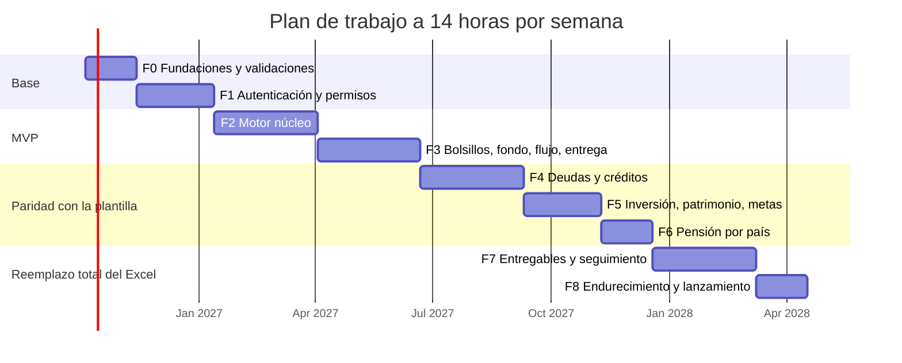

# 06. Plan de trabajo

## 1. Supuestos de la estimación

- **Dedicación: 14 horas por semana** (decisión del 28/09/2026), con apoyo de un agente de código.
- La estimación se hace en horas; una "semana a tiempo completo" equivale a 40 horas. A 14 horas por semana, cada semana a tiempo completo toma unas 2,9 semanas de calendario.
- Las horas incluyen pruebas y documentación de cada fase. Se suma un 15 % de margen en el total.
- **Supuesto:** inicio el lunes 5 de octubre de 2026, sin pausas largas. Si cambia la fecha de inicio o la dedicación, las fechas se corren en proporción.
- Las decisiones de [07-preguntas-abiertas.md](07-preguntas-abiertas.md) marcadas "antes de la fase 0" están resueltas al empezar.

## 2. Fases

| Fase | Contenido | Horas | Acumulado | Fin estimado a 14 h/semana | Depende de |
|---|---|---|---|---|---|
| F0. Fundaciones y validaciones | Monorepo, CI, entornos, cuenta de Google Cloud, prueba de sesión en PWA de iOS, casos de prueba de oro, tokens de diseño, inicio del trabajo legal | 80 | 80 | mediados de noviembre de 2026 | Decisiones previas |
| F1. Autenticación, clientes y permisos | Google y correo con contraseña, invitación, consentimiento, roles, RLS, auditoría, PWA base, lista y ficha de clientes | 120 | 200 | mediados de enero de 2027 | F0 |
| F2. Motor núcleo: perfil, ingresos, presupuesto, resumen | Funciones de Excel, normalización, ingresos y gastos multimoneda, presupuesto con pagador, costo de vida, resumen parcial, antes y después | 160 | 360 | comienzos de abril de 2027 | F1 |
| F3. Bolsillos, fondo, flujo anual, prueba de realidad, cobros y entrega mínima | Bancos y bolsillos, fondo de emergencia, plan de ahorro secuencial, flujo anual, meses sin ingreso, prueba de realidad, cuentas por cobrar, activos líquidos, plan entregado sin PDF, vista "Mi plan" | 160 | 520 | finales de junio de 2027 | F2 |
| F4. Deudas y créditos | Motor único de deudas, simulación, créditos cuota a cuota, marcas de pago, panel | 160 | 680 | comienzos de septiembre de 2027 | F3 |
| F5. Inversión, patrimonio, metas y seguros | Perfil de riesgo, rangos, distribución, proyección, patrimonio completo, metas y calculadora de viaje, seguros | 120 | 800 | comienzos de noviembre de 2027 | F3 (F4 para deuda cara) |
| F6. Pensión por país | Módulo de Colombia completo, módulo informativo de España, activación por cliente | 80 | 880 | mediados de diciembre de 2027 | F3 |
| F7. Entregables y seguimiento | Notas y carta con cifras enlazadas, PDF, ficha de continuidad, Excel compatible, control mensual, plan de acción, comparación con el plan entregado, avisos por correo, exportación y borrado | 160 | 1.040 | comienzos de marzo de 2028 | F4, F5, F6 |
| F8. Endurecimiento y lanzamiento | Accesibilidad, rendimiento, seguridad, textos legales finales, restauración de copias, planes pagados, migración de clientes actuales | 80 | 1.120 | mediados de abril de 2028 | F7 |
| Margen (15 %) | | 168 | **1.288** | **comienzos de julio de 2028** | |

El orden sigue la sugerencia del encargo, con dos ajustes:

1. **Fase 0 nueva.** La sesión en la PWA de iOS y los casos de prueba de oro son los dos riesgos mayores del proyecto; se validan antes de construir pantallas.
2. **Entrega mínima en F3.** Para que el MVP sirva con clientes reales, el cliente necesita ver su plan en la app. La carta en PDF y la exportación a Excel quedan en F7.

Con 14 horas por semana el calendario total es de unos 21 meses. La pregunta A9 de [07-preguntas-abiertas.md](07-preguntas-abiertas.md) propone cómo adelantar el primer uso real.

## 3. MVP e hitos

| Hito | Horas acumuladas | Fecha estimada | Qué se puede hacer |
|---|---|---|---|
| M0. Base validada | 80 | noviembre de 2026 | Sabemos que la sesión funciona en iPhone y tenemos los casos de prueba |
| **M1. MVP** | **520** | **junio de 2027 (julio con margen)** | El asesor atiende un cliente sin deudas de principio a fin en la plataforma (como los dos casos reales): captura, diagnóstico, bolsillos, fondo, flujo, prueba de realidad y plan entregado. El cliente entra por invitación, ve su plan, ajusta ingresos y gastos, y el asesor recibe el antes y después. La carta se sigue escribiendo fuera |
| M2. Deudas | 680 | septiembre de 2027 | Clientes con deudas y seguimiento de créditos por el cliente |
| M3. Paridad de cálculo | 880 | diciembre de 2027 | La plataforma calcula todo lo que calcula la plantilla |
| M4. Reemplazo del Excel | 1.040 | marzo de 2028 | Carta, notas, ficha, exportación a Excel, control mensual y seguimiento dentro de la plataforma |
| M5. Lanzamiento | 1.120 (1.288 con margen) | abril a julio de 2028 | Planes pagados, textos legales validados, clientes actuales migrados con su consentimiento |

Hasta M4, el asesor mantiene el Excel en paralelo para las partes que aún no existen.

## 4. Detalle por fase y criterios de aceptación

### F0. Fundaciones y validaciones (80 horas)

Tareas:

- Monorepo con pnpm y Turborepo, paquetes vacíos con su configuración, reglas de lint que impiden importaciones prohibidas entre paquetes, Vitest y Playwright, CI en GitHub Actions.
- Supabase local (CLI sobre Docker con Colima); conectar el proyecto ya creado (us-east-2) y crear el de staging en la misma región; servidor MCP de Supabase autenticado para el agente.
- Proyecto en Vercel con funciones en `cle1`; dominio.
- Proyecto de Google Cloud, cliente OAuth y pantalla de consentimiento; verificación de marca en Google [F27]. Apple queda aplazado (ADR 0009).
- Prueba de sesión en PWA de iOS (criterios en `02-arquitectura.md`, sección 5.4).
- Casos de prueba de oro: anonimizar C2, construir C1 en la plantilla oficial, extraer C3; script `golden.py` y automatización del recálculo en Excel.
- Tokens de diseño en `packages/ui`.

Avance al 28/09/2026 (PR #1 a #4 unidos):

- [x] Monorepo con pnpm 12 y Turborepo; paquetes `domain`, `engine`, `ui`, `i18n`, `exporters`, `db`, `config`, `web` y `e2e`.
- [x] Reglas de lint que impiden importaciones entre capas y el uso de la fecha del sistema en el motor (verificadas con violaciones de prueba).
- [x] Primer código real: `Money` con moneda obligatoria y conversión a moneda base (modo nativo y modo compatible con la plantilla).
- [x] Tokens de la paleta 3 con prueba automática de contraste WCAG en los temas claro y oscuro.
- [x] App Next.js 16 como PWA: manifiesto, iconos desde el logo provisional, áreas seguras, `proxy.ts` con refresco de sesión de Supabase.
- [x] Pruebas de extremo a extremo en iPhone (WebKit) y Android (Chromium) simulados.
- [x] CI en GitHub Actions (formato, lint, tipos, pruebas, build, extremo a extremo, herramientas de Python), en verde en el pull request #1.
- [x] Configuración local de Supabase (`config.toml`): proveedor de correo activo y contraseña de 8 caracteres como mínimo (ADR 0009, decisión E5).
- [x] Claves del proyecto de Supabase en `apps/web/.env.local` (fuera de git), verificadas contra la API.
- [x] Servidor MCP de Supabase registrado en el alcance local de Claude Code (fuera del repositorio).
- [x] Supabase local funcionando (Docker con Colima).
- [x] Decisión de inicio de sesión: Google y correo con contraseña, Apple aplazado (ADR 0009), con el bloqueo del registro público probado en local.
- [x] Servidor MCP de Supabase autenticado (con `claude mcp login` desde la CLI; el panel de VS Code falla con URLs con parámetros).
- [x] Vincular la CLI con el proyecto remoto (`supabase login` y `link`), verificado contra la base remota.
- [x] Configuración del remoto como código: bloque `[remotes.production]` en `config.toml`.
- [x] Configuración de Auth aplicada al remoto con `supabase config push` (contraseña de 8, código de 6 dígitos, sin TOTP, URL de retorno local).
- [x] Proyecto de Google Cloud (`miluca-510102`) y cliente de OAuth web; Google activo en el Supabase local, verificado hasta la pantalla de inicio de sesión de Google [F37].
- [x] Google activo en el proyecto remoto (`supabase config push`).
- [ ] Proyecto en Vercel (`mi-luca`, plan Hobby) creado y conectado al repositorio el 28/09/2026; `vercel.json` con `cle1`. Dominio de producción: `mi-luca.vercel.app`, ya declarado en `[remotes.production.auth]` de `supabase/config.toml`. Falta: en el panel, Root Directory `apps/web` y variables de entorno (`apps/web/README.md`, "Despliegue en Vercel"); y `pnpm supabase config push` para llevar el dominio a Supabase Auth.
- [ ] Dominio y verificación de marca en Google (requiere al asesor).
- [x] Prueba de la app publicada (`mi-luca.vercel.app`) en el iPhone del asesor, el 29/09/2026: funciona. Quedan por comprobar, cuando haga falta, los criterios de largo plazo (sesión tras 14 días sin abrir) y Android.
- [x] Herramientas de casos de oro: `recalc.py` (recálculo en Excel, validado celda a celda) y `golden.py` (extracción con verificación de privacidad).
- [x] Caso C3 (plantilla vacía) y primera prueba de oro del motor (conversión de moneda de Ingresos).
- [x] Caso de oro C2 (España), anonimizado y revisado por el asesor.
- [x] Caso de oro C1 (Colombia) llevado a la plantilla oficial y anonimizado; reproduce las cifras de la sección 15 del protocolo salvo la inversión anual.
- [ ] Revisión del caso C1 por el asesor (pregunta A11).

Criterios de aceptación:

- CI en verde con un paquete de ejemplo por capa.
- En un iPhone real con las dos versiones mayores más recientes de iOS y en Android con Chrome: entrar con Google y con correo y contraseña dentro de la app instalada, sin terminar en Safari; la sesión sobrevive a cerrar la app y a reiniciar el teléfono.
- Los casos C1, C2 y C3 están en `packages/engine/test/golden/` sin ningún dato identificable (revisión humana documentada).

### F1. Autenticación, clientes y permisos (120 horas)

Tareas: migraciones de identidad, acceso, invitaciones, textos legales, consentimientos, supuestos del caso, auditoría, avisos y solicitudes; RLS y pgTAP; `proxy.ts`; inicio de sesión con Google y con contraseña; gancho que cierra el registro público; recuperación con código y plantillas de correo en Resend; flujo de invitación completo; consentimiento; guía "Agregar a inicio"; manifiesto y service worker; P-A01, P-A02, P-A03 (esqueleto), P-G01, P-G05, P-C01 a P-C04 (inicio vacío), P-C11 (retirar acceso), P-C12.

Avance:

- [x] P-G01 Entrar (`/entrar`): Google y correo con contraseña. Google con PKCE por `/auth/start` y `/auth/callback`; en la app instalada, con `window.open` y aviso por `BroadcastChannel` desde `/auth/listo` (02-arquitectura, 5.4). Ruta de retorno validada contra redirecciones externas.
- [x] Guarda de sesión en el servidor (`requireSessionUser`) y cerrar sesión solo en el dispositivo actual.
- [x] Verificado contra Supabase local en Chromium y WebKit: contraseña correcta e incorrecta, cerrar sesión, ruta de retorno externa descartada y aviso entre ventanas. El inicio con Google llega hasta la pantalla de Google; completarlo requiere una cuenta real.
- [x] En P-G01: enlace "Olvidé mi contraseña". Sin enlaces a privacidad y términos: los avisos se muestran al aceptar la invitación (A7b).
- [x] Migraciones de identidad, acceso e invitaciones (`countries`, `advisors`, `clients`, `advisor_client_access`, `invitations`) con RLS, privilegios por columna, guarda de columnas y historial (`audit_log`); funciones `create_client` y `accept_invitation`. 72 pruebas pgTAP con los criterios de abajo, salvo el borrado a los 7 días.
- [x] Gancho `before_user_created`: solo deja pasar las altas con Google. Verificado en local con Supabase Auth: registro por correo rechazado con 403, alta del servidor con la API de administración aceptada.
- [x] Tipos de TypeScript generados en `packages/db` (`pnpm db:types`) y trabajo de CI para migraciones, pgTAP, lint de SQL y tipos al día.
- [x] Migraciones y gancho aplicados al proyecto remoto el 28/09/2026 (`supabase db push` y `supabase config push`, ejecutados por el asesor). Verificado con el MCP: seis tablas con RLS, dos migraciones registradas; el asesor de rendimiento solo marca índices sin uso (base vacía).
- [x] Primer asesor creado en el remoto el 28/09/2026 (entró con Google; fila de `advisors` desde el editor SQL). Verificado con su sesión simulada: RLS lo reconoce como asesor y ve su nombre.
- [x] Tipografía de la marca (D4): Livvic, alojada con `next/font`, como alternativa libre a Laca (que exige Creative Cloud). Prueba de extremo a extremo: la pantalla usa Livvic y ninguna fuente se pide a otro dominio. En la cuenta de Adobe del asesor quedó un proyecto web vacío ("MiLuca") que se puede borrar.
- [x] Resolución del rol al entrar (`getViewer`): el asesor va a sus clientes, la cuenta sin perfil a P-G02 y el cliente a su inicio.
- [x] P-A01 Clientes (sin buscador todavía), P-A02 Nuevo cliente (sin el correo de la invitación, que llega con el flujo de invitación), P-A03 esqueleto, P-G02 Sin invitación (sin la frase "la cuenta se borra en 7 días" hasta que exista la tarea de borrado) y P-C04 vacío. Verificado contra Supabase local en WebKit: estado vacío, errores junto a cada campo con foco, alta, ficha, lista, 404 y P-G02; sin desborde a 320 px. Revisado con `web-design-guidelines`.
- [x] Invitar desde la ficha (P-A03): enlace con token de 32 bytes que se ve una sola vez, copiar, crear uno nuevo (anula el anterior) y anular con confirmación. Sin correo todavía (C14).
- [x] Flujo del cliente: `/invitacion/[token]` (P-C01, en tú o usted), consentimiento (P-C02) y alta con Google o con contraseña (P-C12, cuenta creada en el servidor con la clave secreta). `accept_invitation` registra los consentimientos en la misma transacción. El token pasa de la URL a una cookie `HttpOnly` del flujo; la página no envía Referer ni se indexa.
- [x] Tablas `legal_texts` (textos inmutables con su sha256) y `consents`, con RLS; `get_invitation` para ver la invitación sin sesión. 35 pruebas pgTAP nuevas (114 en total). Aplicado al remoto el 29/09/2026 (`db push`, ejecutado por el asesor); el asesor de seguridad marcó que `anon` podía ejecutar `accept_invitation`, corregido en una migración aparte.
- [x] Verificado contra Supabase local (asesor en Chromium, cliente en WebKit de iPhone): enlace, copia, anulación, enlace anulado, token inventado, errores de P-C02 y P-C12 con foco, alta con contraseña, perfil activo, dos consentimientos con el texto exacto, historial con su actor, enlace usado y ficha actualizada. Sin desborde a 320 px.
- [x] Borradores de los cuatro textos de P-C02 (tratamiento de datos y datos de salud, Colombia y España) en `docs/legal/textos/`, redactados desde la Ley 1581, el Decreto 1377 y el RGPD consultados el 29/09/2026, y `tools/legal-texts/build_migration.py`, que genera la migración y se niega mientras falte algo.
- [x] Avisos simples de privacidad y de datos de salud, versión 1.0, aprobados por el responsable (A7b) y en la migración `legal_texts_1_0`. Se quitaron los textos de prueba de `supabase/seed/`.
- [x] Retirar el consentimiento de datos de salud desde P-C11 (RGPD, art. 7.3): solo el dueño, una vez y solo ese tipo de texto; la fecha la pone la base. Qué hace la app con esos datos al retirarlo se define en F2 (C20).
- [x] Tarea diaria (`pg_cron`, 08:00 UTC) que borra las cuentas sin perfil a los 7 días; P-G02 ya lo avisa.
- [x] Buscador de P-A01 por nombre visible, con la búsqueda en la URL (`?q=`).
- [ ] Alta con Google desde la invitación en un navegador real (requiere cuenta de prueba en Google).
- [x] P-C03 Agregar a inicio (`/instalar`): al aceptar la invitación, instrucciones de Safari en iPhone, botón "Instalar" en Android cuando el navegador lo ofrece (`beforeinstallprompt`) y texto general en otros equipos; si la app ya corre instalada, sigue al inicio. Verificado en WebKit (iPhone) y Chromium (Android) contra Supabase local.
- [x] P-C11 Privacidad y datos (`/privacidad-y-datos`), primera parte: retirar el acceso del asesor (con confirmación) y devolverlo, y ver los consentimientos con versión y fecha. Verificado contra Supabase local: al retirar, el perfil desaparece de la lista del asesor y su ficha da "No encontramos esta página"; al devolver, vuelve. Enlace desde el inicio del cliente.
- [ ] P-C11: exportar y pedir el borrado (F7). Pedir una sesión reciente antes de retirar el acceso se descartó (A7c).
- [x] P-G05 Recuperar contraseña (`/recuperar`), enlazada desde P-G01: correo, código de 6 dígitos y contraseña nueva, sin salir de la app; responde igual exista o no la cuenta. Plantilla del correo sin enlaces. Verificado contra Supabase local con Mailpit. En producción, los correos salen por el Gmail del responsable (A7c).
- [x] Aviso al asesor cuando el cliente acepta la invitación (`notifications`), arriba de P-A01, con "Marcar como visto".
- [ ] Correo de la invitación (C14): el asesor sigue enviando el enlace a mano. Se puede enviar desde el Gmail cuando haga falta.

Criterios de aceptación:

- Prueba de extremo a extremo: el asesor crea un cliente, lo invita, el cliente acepta en el celular con Google y, en otra prueba, creando su contraseña, y queda vinculado. Un registro por correo sin invitación se rechaza. La recuperación con código funciona dentro de la app instalada.
- pgTAP: el cliente A no lee ni escribe datos del cliente B; un asesor sin acceso no ve al cliente; al revocar, el acceso se pierde en la siguiente consulta; el cliente no puede escribir campos de criterio profesional.
- Cada escritura deja una fila en `audit_log` con actor y valores anteriores.
- Una cuenta sin invitación no ve datos y se borra a los 7 días.

### F2. Motor núcleo (160 horas)

Tareas: `excel`, `normalization`, `incomes`, `budget`, `cost-of-living`, resumen parcial; semillas de parámetros de Colombia y España con fuente y fecha; tablas de ingresos y presupuesto; P-A04 (bloques A a C), P-A05, P-A06, P-A11, P-C06 y P-C07 para ingresos y gastos; registro de impacto y aviso al asesor.

Criterios de aceptación:

- Pruebas de oro de C1, C2 y C3 en verde para los valores de Ingresos y Presupuesto y para `Resumen!C11:C13`.
- Caso España: el costo de vida por niveles coincide con la hoja "Costo de vida" del Excel; con los gastos marcados "paga la familia", el ingreso anual del resumen coincide con el del Excel (15.710,46 EUR) y el indicador nativo de tasa de ahorro sobre ingreso propio es 100 %.
- El cliente edita un gasto en el celular, ve el impacto antes de guardar y el asesor recibe el antes y después.

Avance:

- [x] Motor: `normalization` (`timesPerYear`, con la tabla `Listas!C2:D10`), `incomes` (`computeIncomes`, `socialSecurityPayments`, `baseIncome`) y `budget` (`computeBudget`), en modo compatible. Tipos compartidos en `packages/domain` (`Frequency`, `ExpenseType`, `IncomeKind`, `Payer`, `MonthFlags`) con los mismos códigos que el modelo de datos. `ENGINE_VERSION` 0.2.0.
- [x] Pruebas de oro de C1, C2 y C3 en verde para Ingresos (F:U de cada fila, fila 14, totales por tipo, USD, S17 y la calculadora de ingreso base), Presupuesto (G:I de las 82 partidas y las filas 89 a 97) y `Resumen!C11:C13`. Adaptador de celdas en `test/golden/adapters.ts`; se comprobó que las pruebas fallan con un error provocado.
- [ ] Filas automáticas del presupuesto (6 a 12) calculadas desde Deudas, Seguros y Metas: hoy la prueba toma su valor de la plantilla.
- [ ] Modo nativo: pagador y aporte implícito de terceros (RN-015), indicadores personales y caso España con los gastos de la familia.
- [ ] `cost-of-living` y la hoja "Costo de vida" del caso España.
- [ ] Parámetros por país con fuente y fecha; tablas `incomes`, `budget_items`, `client_fx_rates`; pantallas P-A04 a P-A06, P-A11, P-C06 y P-C07; registro de impacto.

### F3. Bolsillos, fondo, flujo, prueba de realidad, cobros y entrega mínima (160 horas)

Tareas: `cashflow`, `reality-check`, `receivables`, `emergency-fund`, `pockets`, activos líquidos; bancos con límite de bolsillos; P-A07 a P-A10 (pestañas Flujo, Bolsillos, Fondo, Cobros); entrega mínima (plan entregado inmutable y P-C05 sin PDF); control de calidad para los módulos existentes.

Criterios de aceptación:

- Pruebas de oro de C1, C2 y C3 en verde para Flujo anual, Bolsillos y Fondo de emergencia completos, y para `Resumen!C14:C26` y `C35`.
- No se puede entregar un plan con controles bloqueantes.
- Un plan entregado no cambia aunque cambien los datos vivos; la vista "Comparar con hoy" muestra las diferencias.
- **MVP:** un cliente real sin deudas se atiende de principio a fin en la plataforma.

### F4. Deudas y créditos (160 horas)

Tareas: motor único de deudas (120 y 360 meses, seguros, FRECH, orden manual, restricciones de abono, abono único), créditos cuota a cuota, marcas de pago, panel; casos C4 y C5; pantallas de deudas del asesor y P-C10.

Criterios de aceptación: pruebas de oro de C4 (hoja Deudas) y C5 (plantilla de créditos) en verde; `Resumen!C16:C19` en verde; el cliente marca una cuota pagada y el panel se actualiza.

### F5. Inversión, patrimonio, metas y seguros (120 horas)

Criterios de aceptación: pruebas de oro de Inversión (perfil, rango, distribución, proyección), Patrimonio, Metas y Seguros en todos los casos; `Resumen!C25:C28`, `C33:C34`; toda proyección muestra "Ilustrativa, no garantizada"; ninguna pantalla nombra productos ni entidades.

### F6. Pensión por país (80 horas)

Criterios de aceptación: pruebas de oro de la hoja Pensión en C1; `Resumen!C29:C32`; el módulo se desactiva por cliente; España muestra la edad de referencia con fuente y la remisión a la Seguridad Social.

### F7. Entregables y seguimiento (160 horas)

Criterios de aceptación:

- Carta y notas con cifras enlazadas; al entregar, las cifras se congelan y el PDF sigue la estructura de la sección 11 del protocolo.
- El Excel exportado, abierto y recalculado en Excel, da los mismos valores que el motor dentro de la tolerancia.
- La ficha de continuidad tiene todos los campos del Anexo C.
- Control mensual y plan de acción funcionan en el celular del cliente.
- Exportación de datos (JSON y Excel) completa; el borrado elimina todas las filas, archivos y la cuenta, verificado por prueba automática.

### F8. Endurecimiento y lanzamiento (80 horas)

Criterios de aceptación:

- Auditoría de accesibilidad automática sin errores críticos y revisión manual con VoiceOver y TalkBack en los flujos principales.
- Carga de la pantalla de inicio del cliente en red 4G lenta simulada en menos de 3 segundos (**Supuesto** de objetivo).
- Revisión de seguridad: políticas RLS, cabeceras, dependencias, secretos.
- Textos legales aprobados por el responsable y publicados (A7).
- Restauración de una copia de seguridad probada en staging.
- Supabase Pro y Vercel Pro activos antes de migrar el primer cliente real.

## 5. Riesgos

| Riesgo | Probabilidad | Impacto | Mitigación |
|---|---|---|---|
| La sesión se pierde en la PWA de iOS | Media | Alto | Prueba en F0 con dispositivos reales; plan B con token de identidad (`signInWithIdToken`); la web en Safari siempre funciona |
| El motor no reproduce a Excel en algún borde (fechas, redondeos) | Media | Alto | Funciones de Excel probadas aparte; comparación de valores intermedios; tolerancias definidas |
| El caso de prueba de Colombia no existe en la plantilla oficial (H-25) | Resuelto | Medio | Construido en F0 el 28/09/2026 (`c1-colombia`), pendiente de revisión del asesor |
| Ninguno de los casos reales tiene deudas | Cierta | Medio | Casos sintéticos C4 y C5 desde el caso 15.1 del protocolo |
| La plataforma se interpreta como asesoramiento en inversiones regulado | Baja con buenos textos | Alto | Sin productos ni entidades; textos de alcance; puntos de `legal/README.md` decididos por el responsable (A7) |
| Datos de salud en el presupuesto (terapias, medicamentos) | Alta | Medio | Consentimiento explícito aparte; guía para nombrar partidas de forma genérica |
| Transferencia a Estados Unidos (Supabase us-east-2) de los datos de clientes de España | Media | Medio | DPA de Supabase con su evaluación de transferencias [F23]; decisión del responsable antes del primer cliente de España (A7); si no la acepta, segundo proyecto en la UE. Para Colombia, Estados Unidos está declarado adecuado por la SIC [F21] |
| Contraseñas débiles o reutilizadas de los clientes | Media | Alto | Mínimo de longitud, rechazo de contraseñas filtradas (Pro) [F34], límites de intentos; el asesor entra con Google con verificación en dos pasos (ADR 0009) |
| Cambian precios o límites de los proveedores | Media | Bajo | Revisar al contratar; arquitectura portable (Next.js y Postgres estándar) |
| Apple vuelve a restringir las apps de pantalla de inicio en la UE [F10] | Baja | Medio | La app funciona como web en Safari; vigilar |
| El alcance crece y una persona no alcanza | Alta | Medio | MVP estricto, lista de pendientes priorizada, margen del 15 % |
| Pérdida de datos | Baja | Alto | Copias diarias en Pro [F1], prueba de restauración trimestral, PITR si el volumen lo justifica |

## 6. Costos mensuales estimados

Precios en USD consultados el 28/09/2026 (ver [fuentes.md](fuentes.md)). No incluyen impuestos, dominio (**Supuesto:** unos 1 a 2 USD al mes) ni el tiempo de desarrollo.

| Concepto | Desarrollo (F0 a F7, sin datos reales; unos 17 meses) | Lanzamiento, 10 clientes | 100 clientes | 1.000 clientes |
|---|---|---|---|---|
| Supabase | 0 (plan gratuito, 2 proyectos) [F1] | 25 (Pro, incluye cómputo Micro) [F1] | 25 | 25 + 5 a 50 (cómputo Small o Medium, según métricas) [F26] |
| Vercel | 20 (Pro desde el primer despliegue compartido) [F11][F12] | 20 | 20 | 20 + uso sobre el crédito incluido (probablemente 0 a 20) |
| Resend | 0 (gratis) [F25] | 0 | 0 a 20 (Pro si se pasan 100 correos al día) [F25] | 20 [F25] |
| Copias con recuperación a un punto en el tiempo (opcional) | 0 | 0 | 0 | 100 (PITR 7 días) [F1] |
| **Total aproximado** | **unos 20** | **unos 45** | **45 a 65** | **70 a 135 sin PITR; 170 a 235 con PITR** |

Volumen esperado a 1.000 clientes: datos de cada cliente del orden de cientos de kilobytes, historial de cambios de unos pocos gigabytes al año y PDF de unos cientos de kilobytes por plan entregado. **Supuesto:** cabe en los 8 GB de base de datos y 100 GB de archivos de Pro [F1] durante los primeros años.

### Límites de los planes gratuitos

| Servicio | Plan gratuito | Limitación que más importa aquí |
|---|---|---|
| Supabase Free [F1] | 500 MB de base de datos, 50.000 MAU, 1 GB de archivos, 5 GB de salida, 2 proyectos activos, registros de 1 día | **Se pausa tras 1 semana sin actividad y no tiene copias de seguridad** |
| Supabase, correo incluido [F14] | 2 mensajes por hora, solo a miembros del equipo | No sirve para invitar clientes: hace falta SMTP propio desde F1 |
| Vercel Hobby [F11][F12] | 1 millón de invocaciones y 100 GB de transferencia al mes | **Solo uso personal no comercial** |
| Resend Free [F25] | 3.000 correos al mes, 100 al día, 3 dominios | Suficiente hasta unos 100 clientes activos |
| Google OAuth [F27] | Gratis con alcances no sensibles | Verificación de marca para mostrar nombre y logo |

### Cuándo pasar a planes pagados

| Servicio | Momento | Por qué |
|---|---|---|
| Supabase Pro | Antes del primer dato real de un cliente | El plan gratuito no tiene copias de seguridad y pausa el proyecto tras una semana sin actividad [F1] |
| Vercel Pro | En el primer despliegue que vea un cliente (o desde F1 para las vistas previas) | Hobby excluye el uso comercial [F12] |
| Resend Pro | Al pasar de 100 correos al día o 3.000 al mes | Límite del plan gratuito [F25] |
| Cómputo mayor en Supabase | Cuando la CPU o la memoria pasen del 70 % de forma sostenida o haya errores de conexiones | Micro tiene 1 GB y 60 conexiones [F26] |
| PITR | Cuando perder hasta un día de cambios no sea aceptable (muchos clientes editando cada día) | Pro solo restaura copias diarias [F1] |
| Plan Team de Supabase | Si un cliente o regulador exige SOC 2 o ISO 27001 del proveedor | Solo desde Team, 599 USD al mes [F1] |

## 7. Después del lanzamiento (fuera de este plan)

Segundo factor para el asesor, notificaciones push, simulaciones "qué pasa si", más asesores con rol administrador, registro libre, más países, módulo de pensión de España con estimación, integración con extractos bancarios.
