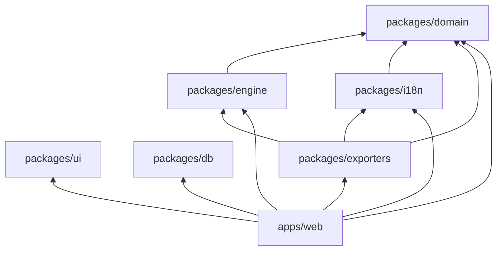

# 08. Estructura del repositorio

Monorepo con pnpm workspaces y Turborepo (ADR 0001). Cada carpeta tiene una sola responsabilidad y un README que dice qué va ahí y qué no.

## 1. Árbol

```
miluca/
├── README.md                     Qué es el proyecto y mapa de carpetas
├── CLAUDE.md                     Reglas para agentes de código
├── .editorconfig, .gitignore
├── .github/workflows/            Integración continua (fase 0)
├── apps/
│   └── web/                      PWA en Next.js: la única aplicación
│       ├── public/               Manifiesto, iconos, pantallas de inicio
│       └── src/
│           ├── app/              Solo rutas, layouts y páginas
│           ├── features/         Un módulo por área del dominio (29 módulos; `assistant` es la IA del asesor, ADR 0012)
│           ├── components/       Componentes de la app compartidos entre módulos
│           ├── lib/              Clientes de Supabase, service worker, utilidades técnicas
│           ├── server/           Código solo de servidor: guardas, impacto de cambios, correo
│           └── styles/           Estilos globales desde los tokens
├── packages/
│   ├── engine/                   Motor de cálculo puro
│   │   ├── src/<modulo>/         Un submódulo por hoja o bloque (21 módulos)
│   │   └── test/                 golden/, excel-compat/, properties/
│   ├── domain/                   Tipos, esquemas zod, catálogos, matriz de permisos
│   ├── ui/                       Tokens y componentes base accesibles
│   ├── i18n/                     Textos por idioma, formatos por país
│   ├── exporters/                Excel compatible, PDF de la carta, ficha de continuidad
│   ├── db/                       Tipos generados de Supabase y clientes tipados
│   └── config/                   tsconfig, lint y formato compartidos
├── supabase/
│   ├── migrations/               SQL versionado: tablas, RLS, disparadores
│   ├── seed/                     Países, parámetros con fuente, catálogos, textos legales
│   ├── functions/                Funciones de servidor de Supabase, si hacen falta
│   └── tests/                    pgTAP: políticas y disparadores
├── tests/e2e/                    Playwright en viewport de celular
├── tools/excel-extractor/        Extractor de fórmulas e inventario (Python)
├── referencia/                   Protocolo y plantillas; casos/ fuera de git
└── docs/                         Este plan, ADR, anexos, diseño, legal
```

## 2. Responsabilidad única: qué va dónde

| Si vas a escribir... | Va en | No va en |
|---|---|---|
| Una fórmula o regla de cálculo | `packages/engine/src/<modulo>/` | Componentes, acciones de servidor, SQL |
| La forma de un dato (tipo, validación, catálogo) | `packages/domain/` | Duplicada en la app o en el motor |
| Una pantalla o formulario de un módulo | `apps/web/src/features/<modulo>/` | `app/` (allí solo se arma la ruta) |
| Una ruta nueva | `apps/web/src/app/` | |
| Un botón, campo o tabla genérica | `packages/ui/` | `features/` |
| Un texto visible | `packages/i18n/messages/es.json` | Escrito a mano en el componente |
| Una consulta o escritura a la base | `apps/web/src/features/<modulo>/server/` | Componentes de cliente |
| Una regla de permiso | Política RLS o disparador en `supabase/migrations/` | Solo en la interfaz |
| Un parámetro de país | `supabase/seed/` (con fuente y fecha) | Constante en el código |
| La generación de un archivo (Excel, PDF) | `packages/exporters/` | La app |
| Una decisión de arquitectura | `docs/adr/` | Solo en un mensaje de commit |

### 2.1 Estructura interna de un módulo de `features/`

```
features/budget/
├── index.ts            API pública del módulo (lo único que importan otros)
├── components/         Componentes de presentación del módulo
├── forms/              Formularios y su validación (esquemas de packages/domain)
├── server/
│   ├── queries.ts      Lecturas (Server Components)
│   └── actions.ts      Escrituras (Server Actions): validar, guardar, recalcular, registrar impacto
└── hooks/              Estado de cliente del módulo, por ejemplo la vista previa del impacto
```

En el código, los módulos de F1 y F2 usan archivos planos (`queries.ts`, `actions.ts`, `validation.ts` y los componentes) en lugar de las subcarpetas de arriba. Un módulo puede tener, además de `index.ts`, un `client.ts`: su API pública para componentes de cliente, sin nada que importe `server-only`, porque un barril que mezcla las dos cosas rompe el build al importarse desde el navegador. La regla de lint de importación lo permite (`apps/web/eslint.config.mjs`).

### 2.2 Estructura interna de un módulo del motor

```
engine/src/budget/
├── index.ts            Funciones públicas del módulo
├── budget.ts           Implementación
├── types.ts            Tipos de salida con la celda que reproducen (@excel Presupuesto!H89)
└── budget.test.ts      Pruebas unitarias del módulo
```

## 3. Reglas de dependencia



| Paquete | Puede importar | No puede importar |
|---|---|---|
| `domain` | Solo librerías externas de validación | Ningún paquete del repositorio |
| `engine` | `domain` | React, Next.js, Supabase, `fs`, `Date.now()` |
| `i18n` | `domain` | `engine`, `ui` |
| `ui` | React y primitivas accesibles | `domain`, `engine`, Supabase |
| `db` | Cliente de Supabase | `engine`, `ui` |
| `exporters` | `engine`, `domain`, `i18n` | Supabase, `apps/web` |
| `apps/web` | Todos | Módulos internos de otro `feature` (solo su `index.ts`, o su `client.ts` desde un componente de cliente) |

Estas reglas se hacen cumplir con reglas de lint de importación en `packages/config` y fallan en CI.

## 4. Convenciones de nombres

- **Código en inglés, producto en español** (ADR 0006). El [glosario](glosario.md) traduce cada término: `pocket` es bolsillo, `emergencyFund` es fondo de emergencia, `realityCheck` es prueba de realidad.
- Carpetas y archivos en `kebab-case`; tipos en `PascalCase`; funciones y variables en `camelCase`; tablas y columnas SQL en `snake_case`.
- Valores de catálogo en español sin tildes (`bola_de_nieve`, `seg_social`), porque viajan a exportaciones y son legibles para el asesor.
- Migraciones: `AAAAMMDDHHMM_descripcion.sql`.
- ADR: `NNNN-titulo-corto.md`.

## 5. Receta: agregar un módulo del dominio

1. Esquema de entrada y salida en `packages/domain`.
2. Funciones puras y pruebas en `packages/engine/src/<modulo>/`; celdas que reproduce en el mapa de las pruebas de oro.
3. Migración con tabla, RLS, guarda de columnas si aplica, disparador de auditoría e índice por `client_id`; prueba pgTAP.
4. Carpeta en `apps/web/src/features/<modulo>/` con consultas, acciones y componentes.
5. Textos en `packages/i18n/messages/es.json`.
6. Fila en la matriz de permisos (`03-modelo-de-datos.md`) y en el glosario.
7. Si cambia un resultado de la plantilla, ADR.

## 6. Qué no se versiona

- `referencia/casos/`: libros con datos de clientes (solo su README).
- `.env*` (salvo `.env.example`), claves `.p8` y `.pem`.
- Salidas de herramientas que puedan contener datos de clientes (`tools/**/salida/`).
